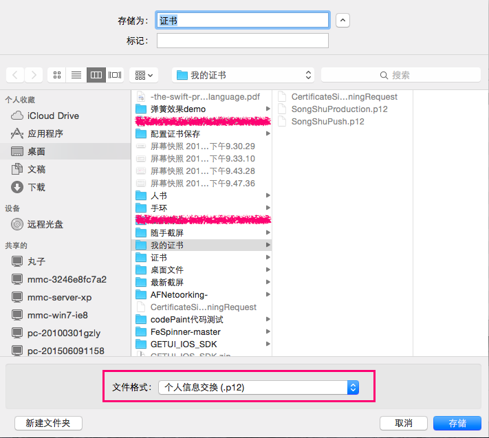

## ios 开发知识总结

### 1.基础

	
1.登录[苹果官网](https://developer.apple.com/),登录成功后在页面右侧选择“Certificates, Identifiers & Profiles”：   
2. 打开“iOS Certificates”页面，可以看到所有已经申请的证书及描述文件：

 
 
### 2.申请苹果App id

	1.在“iOS Certificates”页面“Identifiers"下选择“App IDs"，可查看到已申请的所有App ID，点击右上角的加号可创建新“App ID”：

	2.填写增加信息注意点
	
	App ID Description
		Name: 具有意义性
	
	在“Explicit App ID”栏下的“Bundle ID”项中输入App ID(使用反向域名格式字符串，如“io.dcloud.HBuilderApp”)
		Bundle ID:
	注意：HBuilder中App云端打包界面的AppID栏需要输入此值
	
	App Services
		选择需要的服务（如 Push Notifications） 
	设置完成后选择“Continue”，弹出确认页面，提交生成 App id 
	
#### app id	里面添加消息推送证书

<b>注意：这里的创建证书与申请开发证书、发布证书一样</b>

 
### 3.生成本地CSR证书 （生成证书请求文件）

不管是申请开发(Development)证书，还是发布(Distribution)证书，或者APNS消息推送证书，都需要使用证书请求(.certSigningRequest)文件，证书请求文件需在Mac OS上使用“Keychain Access”工具生成

#### 操作

	点击屏幕左上角的”钥匙串访问”->”证书助理”->”从证书颁发机构请求证书”
	

	
	保存桌面（CertificateSigningRequest.certSigningRequest）

 
### 4.申请开发(Development)证书

在“Certificates, Identifiers & Profiles”页面“Certificates"下选择“Development"，可查看到已申请的所有开发(Development)证书，点击右上角的加号可创建新证书;

打开“Add iOS Certificate”页面，在“Development”栏下选中“iOS App Development”：

继续操作，打开证书生成页面，点击“Choose File...”选择“生成证书请求文件”章节生成的“CertificateSigningRequest.certSigningRequest”文件，点击“Generate”生成cer证书成功

生成证书成功后打开证书下载页面，选择“Download”下载保存证书(ios_development.cer)

双击保存到本地的ios_development.cer文件导入到“Keychain Access”：

右击我们的证书，选择“导出”

选择我们需要保存的地方，要注意下面的文件格式选择“.p12”格式的

现在我们给我们的.p12证书设置密码，一定要记住我们设置的密码，后面的 <b>云端打包私钥密码/推送平台密码</b> 会需要我们设置的密码的

然后选择允许，这样我们的p12证书就生成成功了

注意：此处的密码为自己的电脑密码

 
### 5.申请开发(Development)描述文件
	这里要选择 
		app id 
		CertificateSigningRequest.certSigningRequest 证书
		选择用于调试安装的设备(最多100太设备)
		
#### 注册一个设备或多个设备用于开发测试
	Devices -> iphone 
	 需要 udid 	
	 
#### 添加的设备能够用于安装 ipa
	需要在描述文件里面 勾选上一步注册的设备

### 6.申请发布(Distribution)证书和描述文件

	注意：发布证书和描述文件申请与上同 最主要的事部分参数的选择
	
	
### 7.参考文档

	苹果开发者帐号
	帐号：yixiujishufuwu@aliyun.com
	密码：Aa123123456

[iOS推送集成和配置APNS推送证书教程](http://blog.it985.com/13236.html)

[iOS证书(.p12)和描述文件(.mobileprovision)申请](http://ask.dcloud.net.cn/article/152)

