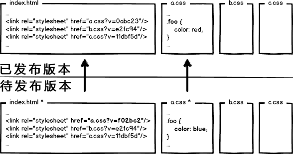

## webpack入门教程  

[webpack 入门](http://html-js.com/article/3113)

### 1. 安装
	npm install -g webpack
	
### 2. 基本使用
	假设项目文件结构如下：
	/app  
	  |--index.html
	  |--js
	  	|--main.js
	  	|--mod.js
	  |--css
	  	|--style.css
	  	|--index.css
 
#### index.html代码如下：

	<!DOCTYPE html>
	<html lang="en">
	<head>
	    <meta charset="UTF-8">
	    <title>Document</title>
	</head>
	<body>
	    
	</body>
	</html>

#### main.js和mod.js代码如下：

	// main.js
	require('./js/mod.js')();

	// mod.js
	module.exports = function() {
	    document.write('hello webpack');
	};

然后执行命令：

<pre>webpack main.js app.js</pre>
会打包生成app.js文件。

### 3. 配置文件

每次手动输入源文件名和输出文件名比较麻烦，可以使用配置文件来进行管理。在app目录下新建webpack.config.js文件，内容如下：
<pre>
	module.exports = {
	    entry: './js/main.js',
	    output: {
	        filename: 'app.js'
	    }
	};
</pre>
然后执行

<pre>
	webpack
</pre>
就会自动生成打包好的文件了。

但是这样每次改了源文件之后都需要手动执行命令，可以通过添加watch来自动检测文件变化并重新打包。配置文件修改如下：
<pre>
module.exports = {
    entry: './js/main.js',
    output: {
        filename: 'app.js'
    },
    watch: true
};
</pre>
配置文件中可以进行其它各种功能的相关配置，详情可以参看[官方文档](http://webpack.github.io/docs/configuration.html)。

### 4. 使用loader

很多模块打包工具只是针对js文件，而webpack的强大之处在于将模块的概念进行了扩展，认为一切静态文件都是模块，包括css、html模板、字体、CoffeeScript等等。虽然webpack本身依然是只能够处理js文件，但是通过一系列的loader，就可以处理其它文件了。

下面以css-loader和style-loader为例，演示如何打包样式文件。首先执行如下命令安装依赖模块：
<pre>
	npm install css-loader style-loader --save-dev
</pre>
然后在app目录下新建style.css文件，内容如下：
<pre>
body {
    background: red;
}
</pre>
然后修改main.js如下：
<pre>
	require('./js/mod.js')();
	require('style!css!./style.css');
</pre>

因为webpack不能够直接处理css文件，因此在require语句中需要指明需要的loader，一个文件可以经由多个loader依次处理，loader与loader之间，以及loader与文件名之间用!分隔。在这个例子中，也可以看出，如果使用了多个loader的话，数据流向是从右向左的，也就是从style.css开始，依次经过css-loader和style-loader。

但是假如有多个css文件的话，每个require语句都需要加上loader说明，很不方便，因此可以在webpack.config.js文件中进行配置，配置如下：

<pre>
loaders: [{
    test: /\.css$/,
    loader: 'style!css'
}]

// or

loaders: [{
    test: /\.css$/,
    loaders: ['style', 'css']
}]
</pre>
关于loader的更多信息，可以参考：

[Using Loaders](http://webpack.github.io/docs/using-loaders.html)
[Loaders](http://webpack.github.io/docs/loaders.html)
[How to write a loader](http://webpack.github.io/docs/how-to-write-a-loader.html) 

### 5. 外部依赖
现在假如该例子中需要用到angular，首先在index.html中通过`<script>`标签引入angular库，然后修改mymodule.js如下：

	var angular = require('angular');
	angular.module('MyModule', []);

	此时如果执行webpack命令会报如下错误：
	
	ERROR in ./mod.js
	Module not found: Error: Cannot resolve module 'angular' in /xxx/xxx/app
	 @ ./mymodule.js 1:14-32
	
	这是因为webpack无法解析angular依赖模块，此时需要在配置文件中对外部依赖进行配置：
	
	externals: {
	    'angular': true
	}

更多信息参考[configuration#externals](http://webpack.github.io/docs/configuration.html#externals)

### 6. 输出类型

现在假如我们希望打包后的文件作为一个单独的库，并且遵循AMD规范可以被被requirejs来使用，可以修改配置文件如下：
<pre>
output: {
    filename: 'app.js',
    library: 'app',
    libraryTarget: 'amd'
}
</pre>
此时输出的app.js结构如下：
<pre>
define("app", ["angular"], function( /* ... */ ) {
    /* ... */
});
</pre>
通过配置output.libraryTarget，可以自定义输出的模块类型，包括AMD，CommonJS，变量等多种输出类型。具体可以参考configuration#output。

### 7. 多文件

现在假如项目目录结构如下：

	/app
	  |--components.js
	  |--index.html
	  |--js
		  |--main.js
		  |--mod.js
		  |--components.js

其中mod.js被main.js和components.js所使用。假如我们希望main.js输出为app.js，而components输出为app.components.js，则可以修改配置文件如下：

	entry: {
	    app: './main.js',
	    app.components: './components.js'
	},
	output: {
	    filename: '[name].js'
	}

## 进阶篇

### 1.开发和部署前端代码
	
#### 小企业非集群部署
需求效果：让url的修改与文件内容关联，也就是说，只有文件内容变化，才会导致相应url的变更，从而实现文件级别的精确缓存控制

	强制浏览器使用本地缓存（cache-control/expires），不要和服务器通信
	数据摘要要算法 

#### 静态资源分集群部署

需求效果：为了进一步提升网站性能，会把静态资源和动态网页分集群部署，静态资源会被部署到CDN节点上，网页中引用的资源也会变成对应的部署路径

##### 大公司的静态资源优化方案，基本上要实现这么几个东西
	配置超长时间的本地缓存 —— 节省带宽，提高性能
	采用内容摘要算法作为缓存更新依据 —— 精确的缓存控制
	静态资源CDN部署 —— 优化网络请求
	更新资源发布路径实现非覆盖式发布 —— 平滑升级

## 收藏

	1、webpack入门 
	http://html-js.com/article/3113
	
	2、webpack进阶
	https://segmentfault.com/a/1190000005742111
	
	3、webpack demo
	
	http://www.cnblogs.com/chris-oil/p/5689017.html
	https://github.com/fwon/gulp-webpack-demo
	
	4、webpack-seed 
	http://www.infoq.com/cn/articles/frontend-engineering-webpack
	https://github.com/chemdemo/webpack-seed (git上的文件结构 、gulp路径错误)
	
	https://github.com/fouber/blog（张云龙博客   前端开发工程解决思路    webpack   and   fis3）

