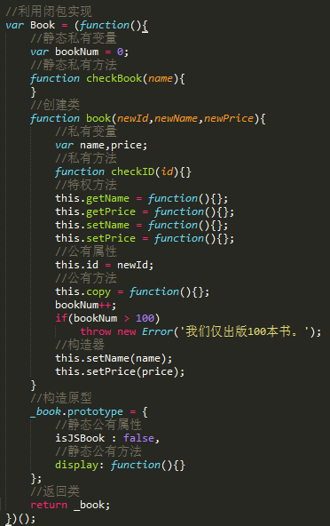
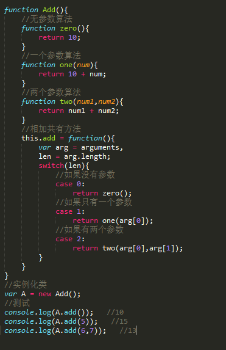
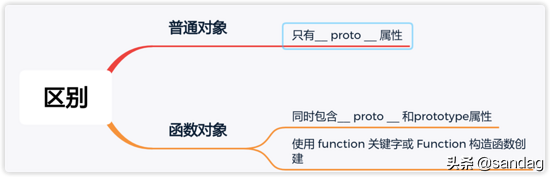
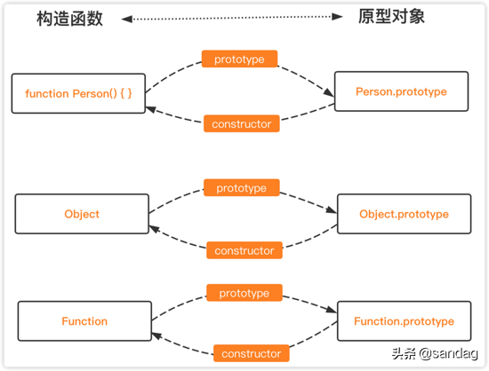
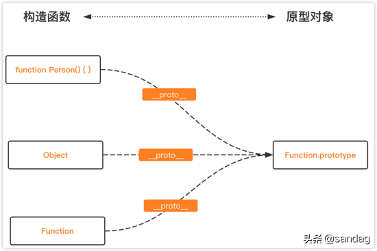
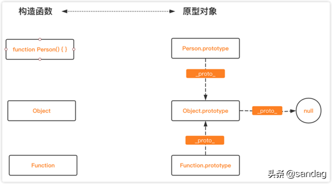
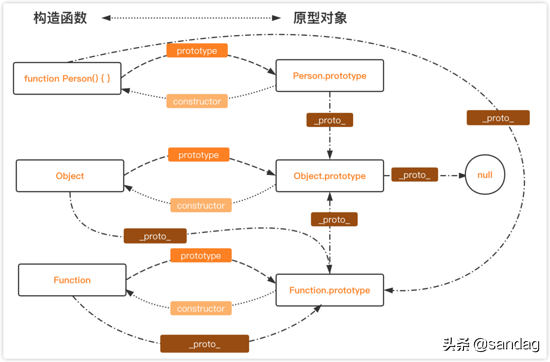
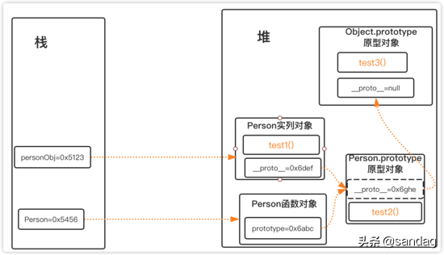
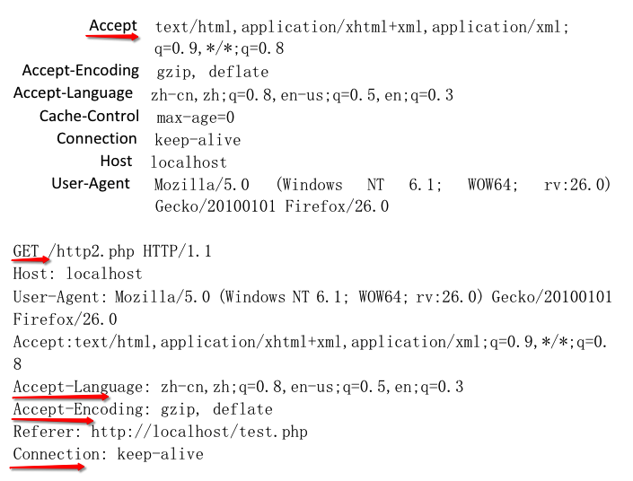

# javascript笔记


## 概念介绍

Dom： document object model 文档对象模型（结构）

BOM：browser object model 浏览器对象模型 

ECMAScript：js的核心标准，同时也是一个解析器 


## Dom知识点归纳

### 1.1、节点类型

元素节点：  每一个HTML标签都是一个元素节点，如 div 、 p、ul等

属性节点 ： 元素节点（HTML标签）的属性，如 id 、class 、name 等

文本节点：(包括回车换行等空字符)  元素节点或属性节点中的文本内容

注释节点：  表示文档注释，形式为`<!-- comment text -->`

文档节点：  表示整个文档（DOM 树的根节点，即 document ）

### 1.2、层级关系

父节点 (统称:祖先节点) 

子节点 (统称:子孙节点) 

兄弟节点

### 1.3、查看节点类型

```
<div id="demo">节点类型举例</div>

<input id="test" value="nodevalue">

```

- 查看节点类型 nodeObject.nodeType ；

元素节点返回 1，属性节点返回 2 。

```
document.getElementById("demo").nodeType;
```
》说明：返回值为 1 

- 查看节点名称 

nodeName	属性 (获取到的都是大写，支持所有节点);

tagName 属性 (获取到的都是大写，只有在元素上生效)

```
document.getElementById("demo").nodeName;

document.getElementById("demo").tagName;
```
》说明：返回值为 DIV 

- 查看节点的值 nodeValue 属性 (只有属性，文本，注释节点才有值)

```
document.getElementById("test").nodeValue;
```

》说明：返回值为 nodevalue

### 1.4、节点

.parentNode	父节点

```
document.getElementById("demo").parentNode
```

说明：返回值为 DIV ;如果指定节点没有父节点，则返回 null

.childNodes	属性返回节点的子节点集合，以 NodeList 对象

>提示：您可以使用 length 属性来确定子节点的数量，然后您就能够遍历所有的子节点并提取您需要的信息
(在标准浏览器下IE8以上,会把换行解析成一个子节点，所以写操作的时候,会报错)

.children 子节点 (非标准，但得到所有浏览器支持)(只返回元素的节点,不返回文本节点)

.cloneNode()	复制节点	 node.cloneNode(deep)

```
var node=document.getElementById("demo").lastChild.cloneNode(true);
document.getElementById("test").appendChild(node);
```

>1.参数为布尔值 可选。默认是 false。
设置为 true，如果您需要克隆节点及其属性，以及后代
设置为 false，如果您只需要克隆节点及其后代
2.克隆所有属性以及它们的值
3.克隆后存在内存里或者变量里

.firstChild	第一个子节点 (在标准浏览器下IE8以上,会获取到空白文本节点)

.firstElementChild	获取第一个子元素节点 (不会获取到空白文本节点,但 ie6/7/8不支持 )

.lastChild	获取最后一个子节点 (在标准浏览器下IE8以上,会获取到空白文本节点)

.lastElementChild	获取最后一个子元素节点 (不会获取到空白文本节点,但 ie6/7/8不支持 )

.nextSibling 下一个兄弟(同级)节点 (在标准浏览器下IE8以上,会获取到空白文本节点)

.nextElementSibling	下一个兄弟(同级)节点 (不会获取到空白文本节点,但 ie6/7/8不支持 )

.previousSibling	上一个兄弟(同级)节点 (在标准浏览器下IE8以上,会获取到空白文本节点)

.previousElementSibling	上一个兄弟(同级)节点 (不会获取到空白文本节点,但 ie6/7/8不支持 )

.offsetParent	找祖先节点有定位的属性的 

	① 如果上面所有祖先节点都没有定位属性的话,IE6/7下就是HTML节点，标准浏览器下为body节点.
	② 如果祖先节点有定位属性,就找到离它最近的那个祖先节点
	③ 如果当前的节点没有定位属性又有浮动,IE6/7下就直接找到上一个祖先节点。标签浏览器下还是找到祖先有定位的节点
	④ 如果当前节点有display:none; IE11以下的IE浏览器参考①②,其他的浏览器都显示为null
	
	★ offset ★
	.offsetLeft/Top	返回当前元素的外边框外开始，到他的offsetParent的内边框的距离.( IE6/7当前节点的offsetParent没触发haslayout(BFC)属性时，取值会不准确 ) 
	offsetWidth/Height	返回当前元素自身的整个元素的宽高。也就是 width/height + padding + border
	并且他们在这个元素为隐藏的时候，获取到的值都是 0
	
	★ client ★
	Width,Height,Left,Top	同上，但是他不会把border算进去 也就是他只算 自身 + padding (所以可视区的宽高都是它计算的)

### 1.5、DOM表格节点

tHead	表格头节点，只有一个

tBodies	表格正文(复数，所以有下标)

tFoot	表格尾，只有一个

rows	行，节点(复数，所以有下标)

cells	列，节点(复数，所以有下标)


## BOM窗口

### 1、window

	window.open()	打开新窗口(4个参数)1.'地址'(为空打开就为空) 2.方式（为空就默认新窗）
	window.close()	关闭
	window.navigator.userAgent	版本信息/用户代理信息( 操作系统、浏览器品牌、浏览器版本号、浏览器内核 )
	window.location	地址栏信息(它是对象)
	.href 当前的url地址，类型string
	.search 获取地址栏的查询部分信息（?到#号之间的所有内容）	▲修改search的值会导致页面重新加载。
	.hash	获取地址栏的锚信息（#号后面的所有内容）	▲修改hash值不会重新加载页面。
	window.innerWidth/Height	获取可视区宽高，标准下才可获取 ie6/7/8下不支持，而且有可能滚动条也会获取	但可以用DOM方法代替，如下行
	document.documentElement.clientWidth/Height (所有浏览器都支持)也可以是 关于详细的请参照 offset跟client
	window.pageXOffset/YOffset	获取滚动条距离的X轴或者Y轴的度数	IE跟火狐下为0，也就是不支持	除了IE跟火狐,其他都OK
	可以用DOM方法代替 document.body.scrollTop(谷歌) || document.documentElement.scrollTop(火狐,IE通用) 
	而且如果要判断一个元素在不在可视区上，就可以用这个元素的offsetTop > 滚动条距离 + 可视区距离
	
	document.body.scrollHeight	获取内容高度或者宽度/内容撑出来的高度或者宽度	
	document.body.scrollWidth	
	①在谷歌下,如果内容度数小于可视区度数,则采用的是可视区高度
	②在ie8以上ie浏览器和firefox下：如果元素的高度没有内容高度高，padding-bottom 和 padding-right 失效，
	③在不同浏览器和不同元素中，scrollHeight有可能会计算边框，也有可能不会计算边框。
	④ie6/7下始终表示内容撑出来的高度。也就是无论大于或者小于设置好的宽或者高，都是撑出来的度数

### 2、iframe

	<iframe src="" ></iframe>
	关于 iframe 标签引用的页面 操作这个引用页面的元素,首先要获取当前document下的iframe标签，然后这个变量的 contentWindow 就相当于引用过来的 window了
	
	如果想操作引用当前页面的那个页面,那么就在被引用的页面的 window.parent.document 就可以操作当前页面的父级，也就是引用这个页面的那个页面
	如果要找到引用当前页面的最顶级父级文档的window，那就是window.top
	并且为了防钓鱼网站，就可以在window.onload的时候 判断一下 window.top是不是我当前域名下的最顶层：如下
	
	if(window = window.top){
		window.top.location.href = window.location.href
	}


### 3、定时器

#### 3.1、开启

	setInterval 间隔每秒发生事件(连续)
	setTimeout 时间到了后发生一次事件（如果出现渲染问题，找到问题所在，然后就用延迟定时器）
	定时器里的第一个参数是每次执行的函数，第2为时间，第3个参数是传参，然后这个被传的参数会在定时器的第一个参数也就是函数里的第一个参数就是被传进去的参数

```
	setTimeout(function(){},1000);
```

#### 3.2、停止

	clearInterval 停止间隔定时器
	clearTimeout 停止延迟定时器


## 元素创建与输出

```	
var 变量=document.createElement('标签名')	创建元素并且保存到一个变量里面，方便输出到某个地方去
```

### 1、创建元素

.appendChild	

>父级.appendChild( oLi )	追加（也就是放到最尾）放到这个父级下

.insertBefore

>父级.insertBefore(oLi,父级.firstChild)	放到父级的第一个子节点下，也就是放到第一位,如果不写第2个参数，就默认追加，也就是放到最后

.removeChild

>父级.removeChild(要删除的子节点)	从一个节点里面删除指定的子节点。也可以 this 删除自己。删除后会把删除的对象作为返回值返回
	并且，内存当中还是存在这个DOM元素的，也就是没有真正的清楚，这个时候把返回来的对象，赋值为空类型就在内存当中完全删除了

.replaceChild

>父级.replaceChild(oLi,oUl.children[0])	替换，参数必须设置两个（用来替换的节点，被替换掉的子节点）
	注意注意《追加》《第一个》《替换》如果不是操作创建的元素,而是操作已有的元素,那么直接移动那个元素,不会复制

### 2、操作元素属性

元素.getAttribute('属性名称')	获取属性

元素.setAttribute('名称','值')	设置属性

元素.removeAttribute('')	删除属性

	都有兼容问题:
	1，当操作的属性是关键字或保留字的时候，IE6/7会不一样. 例如 标准 class IE6/7 就得 className ||一下就OK
	2，当操作两层及以上属性的时候，只有ie浏览器支持，其它浏览器都不支持。
	
	好处:
	1，可以操作行间的自定义属性。 
	2，可以获取src/href等的相对地址。（设置第2个参数为2,IE6/7下也是相对）

### 3、获取样式 getComputedStyle()	

获取经过计算后的样式值，如: getComputedStyle(获取的元素).width IE6到8不兼容 

currentStyle	专门兼容IE的 
如: 获取到的元素变量.currentStyle.width 主流不兼容这个时候简单判断一下，为了获取是什么浏览器执行什么代码可以写个判断 如:(三目) 某获取到元素.currentStyle? 条件1:条件2;


## 事件

### 1、概念

事件捕获指的是从document到触发事件的那个节点，即自上而下的去触发事件。

事件冒泡是自下而上的去触发事件。

绑定事件方法的第三个参数，就是控制事件触发顺序是否为事件捕获。true,事件捕获；false,事件冒泡。默认false,即事件冒泡。

Jquery的e.stopPropagation会阻止冒泡，意思就是到我为止.

### 2、绑定事件监听

绑定事件的另一种方法是用 addEventListener() 或 attachEvent() 来绑定事件监听函数。

W3C规范中定义了3个事件阶段，依次是捕获阶段、目标阶段、冒泡阶段。


```
<div id="parent">
　　<div id="child" class="child"></div>
</div>
```

### 3、事件捕获

	document.getElementById("parent").addEventListener("click",function(e){
	    alert("parent事件被触发，"+e.target.id);
	},true)
	
	document.getElementById("child").addEventListener("click",function(e){
		alert("child事件被触发，"+e.target.id)
	}, true)

结果：parent事件被触发, child事件被触发
结论：先parent,然后child。事件触发顺序变更为自外向内，这就是事件捕获。 

### 4、事件冒泡    

	document.getElementById("parent").addEventListener("click",function(e){
	    alert("parent事件被触发，"+e.target.id);
	}, false)
	      		
	document.getElementById("child").addEventListener("click",function(e){
		alert("child事件被触发，"+e.target.id)
	}, false)


​	

结果：child事件被触发, parent事件被触发
结论：先child，然后parent。事件的触发顺序自内向外，这就是事件冒泡

### 5、事件委托/事件代理

事件委托，其实是使用了冒泡的原理，从点击的元素开始，递归方式的向父元素传播事件，这样做的好处是对于大量要处理的元素，不必为每个元素都绑定事件，只需要在他们的父元素上绑定一次即可，提高性能。 还有一个好处就是可以处理动态插入dom中的元素，直接绑定的方式是不行的。

>应用场景：就是为多个相同的dom节点绑定一个事件即可

### 6、注销事件绑定

一般普通事件绑定的直接让那个事件等于null即可注销绑定
对象.removeEventListener()	注销被	addEventListener()绑定的事件，而且要在同一个阶段注销

对象.detachEvent()	注销被	attachEvent()绑定的事件
匿名函数是没有办法被注销的

### 7、消息队列和事件循环 (注意)

消息队列：消息队列是一个先进先出的队列，它里面存放着各种消息

事件循环：事件循环是指主线程重复从消息队列中取消息、执行的过程。

实际上，主线程只会做一件事情，就是从消息队列里面取消息、执行消息，再取消息、再执行。当消息队列为空时，就会等待直到消息队列变成非空。而且主线程只有在将当前的消息执行完成后，才会去取下一个消息。这种机制就叫做事件循环机制，取一个消息并执行的过程叫做一次循环

用图表示这个过程就是


>总结：异步过程的回调函数，一定不在当前这一轮事件循环中执行


## js数据类型

### 1、5种基本数据类型	

string 字符串 、
number	数字、
boolean	布尔值、
undefined 未定义的、 
null 空值

>引用类型：object、Array和Function

### 2、typeof 用来判断所属何种类型

上面是按照typeof 的形式去判断类型的，按照ECMAScript标准的话，一般有两个类型，就是简单类型跟引用类型，首先标准下的类型有：
	
>1. object(引用类型) 
>2. number(数字->简单)	
>3. string(字符串->简单)	
>4. boolean (布尔值->简单)	
>5. null(空值->简单)	
>6. undefined(未定义->简单)


### 3、类转换型

#### 3.1、显示类型转换 强制

>Number	尽量转成数字类型

>parseInt	从左到右转换成整数遇见非数字后，非数字后面的统统不要，而且转换的东西基本上只能是字符串或前面带数字类型的东西，（它认符号）

>parseFloat	从左到右转换，保留小数。其他如上

>NAN	转换失败也算是数字类型里的非数字。布尔值等于假false，而且他不等于他本身。

>isNaN	判断不是数字，值为布尔值.不是数字就为真.但他是通过Number()判断为是不是数字的

#### 3.2、隐式类型转换

	'200'-3	变成数字类型了
	然后 - * / % ++ -- 都会把字符串变成数字类型，
	200+ '3'	变成字符串了
	!100	取反，！，就是取反，一般取的都是布尔值
	如果是 == 全等 或者 ===强等的话， '2'==2;是真，比的是里面的,'2' === 2;为假，强等判断所有条件类型都要一样


## 字符串合集

### 1、定义

```
	var str = new String();	用对象定义一个字符串
```

### 2、方法

.charAt()	从整个字符串里面找到某个，只能获取到一个参数，参数为下标

.charCodeAt()	把被传进的参数编程一个字符串编码

.fromCharCode()	被传进去的数字编码会被转换成字符串

.substring()	截字符串,被传参为一个数字的时候，从被传参的第一个数字位置开始找到后面的，如果有两个参数，无论顺序，按小到大的参数，找到位置里的字符串

.slice()	跟上面一样是截字符串，不同的是它不具备交换位置顺序去找，但不同的是他的负数会倒回字符串最后一位去计算

.indexOf()	左往右找到被传参字符串的位置，只找一次，当如果这个字符串参数后面跟一个,然后非负数数字(负数默认为0)的话就表示从第几个开始找后面的
被传参的字符串可以是多个，但获取到的位置是被传参的第一个字符串的位置(找不到结果为-1就假)

.lastIndexOf()	右往左找到被传参字符串的位置，只找一次，其他跟上面一样。

.toUpperCase()	把字符串里面的英文全部转换成大写,不接收参数

.toLowerCase()	把字符串里面的英文全部转换成小写,不接收参数

.split()	分隔，被传参的是带引号的，而且是字符串里的某个，转换的都是一个数组,如果传进的是一个空字符串，就是字符串每个分隔成一个数组的一个
传参进去的那个分隔符的字符串会被当做分隔符，就会消失，而且分隔后，不管左右有没东西，没有，就加个未定义进去.被传参的字符串如果后面还有个数字
的话，那就是限制这个数组多长的意思，如果原来的length小，那么会左往右，只要这个数字的长度，后面的不要了(这个为可选参数)

.join()	把数组转换成字符串,如果不传参,默认为传了一个','，因为他必须有一个参数隔开数组的个数，再链接到一起链接成一个字符串

### 3、特定方法

	encodeURI('string')	window底下的方法，可把字符串作为 UTF-8 进行编码
	encodeURIComponent('string')	如上，但会把一些转义符号也进行编码
	decodeURI()	把UTF-8编码过的内容进行解码
	decodeURIComponent()	如上，但会把一些转义符号编码的也进行解码出来	
	
	.call	函数特有方法,用来改变this的指向 如：fn.call(某个对象,后面的参数接下去正常继续按顺序传参)面向对象需要此方法继承
	.apply(参数1,参数2)	第一个参数也是改变this指向,第2个参数是一个arr，而且会把这个arr返回给调用它的obj

​	

## Array 

除了 Object 之外， Array 类型恐怕是 ECMAScript 中最常用的类型了。而且，ECMAScript 中的数组与其他多数语言中的数组有着相当大的区别。虽然 ECMAScript 数组与其他语言中的数组都是数据的有序列表，但与其他语言不同的是，ECMAScript 数组的每一项可以保存任何类型的数据。也就是说，可以用数组的第一个位置来保存字符串，用第二位置来保存数值，用第三个位置来保存对象，以此类推。而且，CMAScript 数组的大小是可以动态调整的，即可以随着数据的添加自动增长以容纳新增数据。

### 1、数组的定义

#### 1.1、构造函数模式

```
var colors = new Array("red", "blue", "green"); 
//创建一个包含 3 项，即字符串red", "blue", "green"的数组

var colors = new Array(3); 
// 创建一个包含 3 项的数组，实际项目中，很少有人这么写；

var colors = Array("red", "blue", "green"); 
//构造函数的new是可以省略的；
```

#### 1.2、数组籽棉量表示法

数组字面量由一对包含数组项的方括号表示，多个数组项之间以逗号隔开

    var colors = ["red", "blue", "green"]; 
    // 创建一个包含 3 个字符串的数组
    
    var names = []; 
    // 创建一个空数组
    
    var values = [1,2,]; 
    // 不要这样！这样会创建一个包含 2 或 3 项的数组
    
    var options = [,,,,,]; 
    // 不要这样！这样会创建一个包含 5 或 6 项的数组


在 IE 中， values 会成为一个包含 3 个项且每项的值分别为 1、2 和 undefined 的数组；在其他浏览器中， values 会成为一个包含 2项且值分别为1 和 2 的数组。原因是 IE8 及之前版本中的 ECMAScript 实现在数组字面量方面存在 bug。由于这个 bug导致的另一种情况如最后一行代码所示，该行代码可能会创建包含 5 项的数组（在 IE9+、Firefox、Opera、Safari 和 Chrome 中），也可能会创建包含 6 项的数组（在 IE8 及更早版本中）。在像这种省略值的情况下，每一项都将获得 undefined 值；这个结果与调用 Array 构造函数时传递项数在逻辑上是相同的。但是由于 IE 的实现与其他浏览器不一致，因此强烈建议不要使用这种语法。

在读取和设置数组的值时，要使用方括号并提供相应值的基于 0 的数字索引，如下所示：**数组的索引是以0开始的,一定要注意**

            var colors = ["red", "blue", "green"]; // 定义一个字符串数组
            console.log(colors[0]); // 显示第一项,可以思考下，如果访问的索引超过数组长度呢？会返回什么
            colors[2] = "black"; // 修改第三项
            colors[3] = "brown"; // 新增第四项,如果设置某个值的索引超过了数组现有项数,数组就会自动增加到该索引值加 1 的长度（就这个例子而言，索引是 3，因此数组长度就是 4）

### 2、数组的length属性

数组的项数保存在其 length 属性中，这个属性始终会返回 0 或更大的值，如下面这个例子所示：

    var colors = ["red", "blue", "green"]; // 创建一个包含 3 个字符串的数组
    var names = []; // 创建一个空数组
    console.log(colors.length); //3
    console.log(names.length); //0

数组的 length 属性很有特点——它不是只读的。因此，通过设置这个属性，可以从数组的末尾移除项或向数组中添加新项。

```
var colors = ["red", "blue", "green"];  // 创建一个包含 3 个字符串的数组
colors.length = 2;
console.log(colors[2]);                 //undefined，此时的colors数组已经被改变了；数组 colors 一开始有 3 个值。将其 length 属性设置为 2 会移除最后一项（位置为2 的那一项），结果再访问 colors[2] 就会显示 undefined 了。
colors.length = 10;
console.log(colors[9]);                 //undefined,虽然 colors 数组包含 2 个项，但把它的 length 属性设置成了 10。这个数组不存在位置 9，所以访问这个位置的值就得到了特殊值 undefined 。
```

利用 length 属性也可以方便地在数组末尾添加新项

```
var colors = ["red", "blue", "green"]; // 创建一个包含 3 个字符串的数组
colors[colors.length] = "black"; // （在位置 3 ）添加一种颜色
colors[colors.length] = "brown"; // （在位置 4 )再添加一种颜色
```

 > 由于数组最后一项的索引始终是 length-1 ，因此下一个新项的位置就是 length 。每当在数组末尾添加一项后，其 length 属性都会自动更新以反应这一变化。

**数组中的小技巧**

 获取或者修改数组的长度，例如：ary.length=ary.length-1就是删除数组的最后一项；数组中的splice相对来说实现删除的时候，每删除一项后面的索引都需要重新的计算，比较耗费性能，如果要删除数组中所谓为n这一项，我们可以这样去写；          

    ary[n]=ary[ary.length-1];//首先把数组的最后一项替换当前的项
    ary.length=ary.length-1;//然后在删除数组的最后一项

### 3、数组的方法

#### 3.1、es5方法

.push 向数组末尾增加新元素，返回新增后数组的长度，原有的数组改变；

```
var ary=[];
ary.push(12);
```

.pop 删除数组末尾的元素，返回删除的内容，原有的数组改变；

```
var ary=[1，2，3，4];
ary.pop();
```

.shift 删除数组第一位元素，返回删除后的内容，原有的数组改变；

```
var ary=[1，2，3，4];
ary.shift();
```

.unshift 向数组开头增加新元素，返回新增后数组的长度，原有的数组改变（IE6,7的返回值是未定义正常的是新的长度）；

```
var ary=[];
ary.unshift(12);
```

.splice

​	splice(n,m)   从索引n开始删除m个元素，把删除的部分当作新数组返回，原有的数组改变

​	splice(n,m,x) 从索引n开始删除m个元素，把删除的部分当作新数组返回，并且用x替换原来位置的内容，原有的数组改变

​	splice(n,0,x) 把x添加到指定索引n之前；

.slice

​	slice(n,m)    从索引n开找到索引m处(不包含m)，将找到的内容放到新数组返回，原有的数组不变

​	slice(n)      从索引n处一直找到数组末尾；

​	slice(0)      数组克隆

.concat        基于当前数组中所有项创建新数组,原有数组不变

ary1.concat() 相当于slice(0)也是克隆数组

```
var color = ['red','green']
var color2 = colors.concat("yellow",["black","brown"])
```

.join      将数组按照指定的分隔符拆分字符串，原有的数组不变

.toString  将数组转化为字符串，原有的数组不变

.sort      数组排序的方法，原有数组改变，我们通常这样写，

```
ary.sort(function(a,b){return a-b;});来实现数组的升序排列 
```

.reverse    将数组倒过来排序，原来数组改变

.indexOf / lastIndexOf 获取数组中某一项的索引，通常用来检测数组中是否包含某一项内容，不包含返回的是-1；这个方法在IE678下不兼容；

.forEach   循环数组中每一项，然后进行相关的操作，这个方法在IE678不兼容，

```
ary.forEach(function(item,index,input){},cantext);
第二个参数是指定函数中的this，不写默认是window
```

.map    循环数组中的每一项，然后进行相关的操作，相对于forEach来说，map有返回值，可以修改数组中某一项，IE678不兼容，

```
ary.map(function(item,index,input){},cantext);第二个参数是指定函数中的this，不写默认是window
```

.some  是对数组中每一项运行指定函数，如果该函数对**任一项**返回true，则返回true

```
ary.some(function(item){})
```

.every 是对数组中每一项运行给定函数，如果该函数对**每一项**返回true,则返回true

```
ary.every(function(item){})
```

.filter 创建一个新的数组，新数组中的元素是通过检查指定数组中符合条件的所有元素

```
ary.filter(function(item){})
```

对数组中的每个元素都执行一次指定的函数（callback），并且创建一个新的数组，该数组元素是所有回调函数执行时返回值为true的原数组元素

filter()不会对空数组进行检测

filter()不会改变原始数组


#### 3.2、es6数组新增方法

.find 参数为回调函数，回调函数可以接收3个参数，值x、索引i、数组arr，回调函数默认返回值x

	let arr=[1,2,234,'sdf',-2];
	arr.find(function(x){
	    return x<=2;
	})//结果：1，返回第一个符合条件的x值
	arr.find(function(x,i,arr){
	    if(x<2){console.log(x,i,arr)}
	})//结果：1 0 [1, 2, 234, "sdf", -2]，-2 4 [1, 2, 234, "sdf", -2]

.findIndex findIndex和find差不多，不过默认返回的是索引

.includes 与string的includes一样，接收2参数，查询的项以及查询起始位置

	let arr=[1,2,234,'sdf',-2];
	arr.includes(2);// 结果true，返回布尔值
	arr.includes(20);// 结果：false，返回布尔值
	arr.includes(2,3)//结果：false，返回布尔值

.keys 对数组索引的遍历

	let arr=[1,2,234,'sdf',-2];
	for(let a of arr.keys()){
	    console.log(a)
	}
	//结果：0,1,2,3,4  遍历了数组arr的索引

.values 对数组项的遍历

	let arr=[1,2,234,'sdf',-2];
	for(let a of arr.values()){
	    console.log(a)
	}
	//结果：1,2,234,sdf,-2 遍历了数组arr的值

.entries 对数组键值对的遍历

	let arr=['w','b'];
	for(let a of arr.entries()){
	    console.log(a)
	}
	//结果：[0,w],[1,b]
	
	for(let [i,v] of arr.entries()){
	    console.log(i,v)
	}
	//结果：0 w,1 b

.fill 改变原数组，当第三个参数大于数组长度时候，以最后一位为结束位置

	let arr=['w','b'];
	arr.fill('i')//结果：['i','i']，改变原数组
	arr.fill('o',1)//结果：['i','o']改变原数组,第二个参数表示填充起始位置
	new Array(3).fill('k').fill('r',1,2)//结果：['k','r','k']，第三个数组表示填充的结束位置

.copyWithin(s,m,n) 接收三个参数，被替换数据的开始处、替换块的开始处、替换块的结束处(不包括)

	["w", "i", "r"].copyWithin(0)//此时数组不变
	["w", "i", "r"].copyWithin(1)//["w", "w", "i"],数组从位置1开始被原数组覆盖，只有1之前的项0保持不变
	["w", "i", "r","b"].copyWithin(1,2)//["w", "r", "b", "b"],索引2到最后的r,b两项分别替换到原数组1开始的各项，当数量不够，变终止
	["w", "i", "r",'b'].copyWithin(1,2,3)//["w", "r", "r", "b"]，强第1项的i替换为第2项的r

Array.of() 方法永远返回一个数组，参数不分类型，只分数量，数量为0返回空数组

	Array.of('w','i','r')//["w", "i", "r"]返回数组
	Array.of(['w','o'])//[['w','o']]返回嵌套数组
	Array.of(undefined)//[undefined]依然返回数组
	Array.of()//[]返回一个空数组

Array.from(obj,fn) 可以把带有lenght属性类似数组的对象转换为数组，也可以把字符串等可以遍历的对象转换为数组，它接收2个参数，转换对象与回调函数

	Array.from({'0':'w','1':'b',length:2})//["w", "b"],返回数组的长度取决于对象中的length，故此项必须有！
	Array.from({'0':'w','1':'b',length:4})//["w", "b", undefined, undefined],数组后2项没有属性去赋值，故undefined
	Array.from({'0':'w','1':'b',length:1})//["w"],length小于key的数目，按序添加数组
	
	//////////////////////////////
	let divs=document.getElementsByTagName('div');
	Array.from(divs)//返回div元素数组
	Array.from('wbiokr')//["w", "b", "i", "o", "k", "r"]
	Array.from([1,2,3],function(x){
	        return x+1})//[2, 3, 4],第二个参数为回调函数
	})


## object

### 1、简介

JavaScript 原生提供Object对象

JavaScript 的所有其他对象都继承自Object对象，即那些对象都是Object的实例。

Object对象的原生方法分成两类：Object自身的方法与Object的实例方法。

- Object对象自身的方法

所谓”自身的方法“就是直接定义在Object对象的方法。

```
Object.print = function (o) { 
	console.log(o) 
};
```

上面代码中，print方法就是直接定义在Object对象上。

Object的实例方法

所谓实例方法就是定义在Object原型对象Object.prototype上的方法。它可以被Object实例直接使用。

```
Object.prototype.print = function () {
  console.log(this);
};

var obj = new Object();
obj.print() // Object

```

上面代码中，Object.prototype定义了一个print方法，然后生成一个Object的实例obj。obj直接继承了Object.prototype的属性和方法，可以直接使用obj.print调用print方法。也就是说，obj对象的print方法实质上就是调用Object.prototype.print方法。

>凡是定义在Object.prototype对象上面的属性和方法，将被所有实例对象共享就可以了。

### 2、Object()

1、Object本身是一个函数，可以当作工具方法使用，将任意值转为对象。这个方法常用于保证某个值一定是对象。

如果参数为空（或者为undefined和null），Object()返回一个空对象。

```
var obj = Object();
// 等同于
var obj = Object(undefined);
var obj = Object(null);

obj instanceof Object // true
```

上面代码的含义，是将undefined和null转为对象，结果得到了一个空对象obj。

2instanceof运算符用来验证，一个对象是否为指定的构造函数的实例。obj instanceof Object返回true，就表示obj对象是Object的实例。

如果参数是原始类型的值，Object方法将其转为对应的包装对象的实例

```
var obj = Object(1);
obj instanceof Object // true
obj instanceof Number // true

var obj = Object('foo');
obj instanceof Object // true
obj instanceof String // true

var obj = Object(true);
obj instanceof Object // true
obj instanceof Boolean // true
```

上面代码中，Object函数的参数是各种原始类型的值，转换成对象就是原始类型值对应的包装对象。

如果Object方法的参数是一个对象，它总是返回该对象，即不用转换。

```
var arr = [];
var obj = Object(arr); // 返回原数组
obj === arr // true

var value = {};
var obj = Object(value) // 返回原对象
obj === value // true

var fn = function () {};
var obj = Object(fn); // 返回原函数
obj === fn // true
```

利用这一点，可以写一个判断变量是否为对象的函数。

function isObject(value) {
  return value === Object(value);
}

isObject([]) // true
isObject(true) // false

### 3、Object 构造函数  

Object不仅可以当作工具函数使用，还可以当作构造函数使用，即前面可以使用new命令。

Object构造函数的首要用途，是直接通过它来生成新对象。

```
var obj = new Object();
```

**注意:**通过var obj = new Object()的写法生成新对象，与字面量的写法var obj = {}是等价的。或者说，后者只是前者的一种简便写法。
Object构造函数的用法与工具方法很相似，几乎一模一样。使用时，可以接受一个参数，
如果该参数是一个对象，则直接返回这个对象；
如果是一个原始类型的值，则返回该值对应的包装对象。

```
var o1 = {a: 1};
var o2 = new Object(o1);
o1 === o2 // true

var obj = new Object(123);
obj instanceof Number // true
```

虽然用法相似，但是Object(value)与new Object(value)两者的语义是不同的，
Object(value)表示将value转成一个对象，
new Object(value)则表示新生成一个对象，它的值是value。

### 4、Object构造函数的属性

Object.length
值为1。

Object.prototype
可以为所有 Object 类型的对象添加属性。

### 5、Object构造函数的方法

```
Object.assign()
通过复制一个或多个对象来创建一个新的对象。 

Object.create()
使用指定的原型对象和属性创建一个新对象。

Object.defineProperty()
给对象添加一个属性并指定该属性的配置。

Object.defineProperties()
给对象添加多个属性并分别指定它们的配置。

Object.entries()
返回给定对象自身可枚举属性的[key, value]数组。

Object.freeze()
冻结对象：其他代码不能删除或更改任何属性。

Object.getOwnPropertyDescriptor()
返回对象指定的属性配置。

Object.getOwnPropertyNames()
返回一个数组，它包含了指定对象所有的可枚举或不可枚举的属性名。

Object.getOwnPropertySymbols()
返回一个数组，它包含了指定对象自身所有的符号属性。

Object.getPrototypeOf()
返回指定对象的原型对象。

Object.is()
比较两个值是否相同。所有 NaN 值都相等（这与==和===不同）。

Object.isExtensible()
判断对象是否可扩展。

Object.isFrozen()
判断对象是否已经冻结。

Object.isSealed()
判断对象是否已经密封。

Object.keys()
返回一个包含所有给定对象自身可枚举属性名称的数组。

Object.preventExtensions()
防止对象的任何扩展。

Object.seal()
防止其他代码删除对象的属性。

Object.setPrototypeOf()
设置对象的原型（即内部[[Prototype]]属性）。

Object.values()
返回给定对象自身可枚举值的数组
```

###### 举例

```
Object.keys()，Object.getOwnPropertyNames()

```

Object.keys方法和Object.getOwnPropertyNames方法都用来遍历对象的属性。

Object.keys方法的参数是一个对象，返回一个数组。该数组的成员都是该对象自身的（而不是继承的）所有属性名。

```
var obj = {
  p1: 123,
  p2: 456
};

Object.keys(obj) // ["p1", "p2"]
```

Object.getOwnPropertyNames方法与Object.keys类似，也是接受一个对象作为参数，返回一个数组，包含了该对象自身的所有属性名。

```
var obj = {
  p1: 123,
  p2: 456
};

Object.getOwnPropertyNames(obj) // ["p1", "p2"]
```

**注意：** 对于一般的对象来说，Object.keys()和Object.getOwnPropertyNames()返回的结果是一样的。
只有涉及不可枚举属性时，才会有不一样的结果。Object.keys方法只返回可枚举的属性，Object.getOwnPropertyNames方法还返回不可枚举的属性名。

```
var a = ['Hello', 'World'];

Object.keys(a) // ["0", "1"]
Object.getOwnPropertyNames(a) // ["0", "1", "length"]

```

上面代码中，数组的length属性是不可枚举的属性，所以只出现在Object.getOwnPropertyNames方法的返回结果中。

由于 JavaScript 没有提供计算对象属性个数的方法，所以可以用这两个方法代替。

```
var obj = {
  p1: 123,
  p2: 456
};

Object.keys(obj).length // 2
Object.getOwnPropertyNames(obj).length // 2
```

一般情况下，几乎总是使用Object.keys方法，遍历数组的属性。

### 6、Object 实例和Object 原型对象

JavaScript中的所有对象都来自Object；所有对象从Object.prototype继承方法和属性，尽管它们可能被覆盖。

### 7、Object实例属性

```
Object.prototype.constructor
特定的函数，用于创建一个对象的原型。

Object.prototype.__proto__ 
指向当对象被实例化的时候，用作原型的对象。

Object.prototype.__noSuchMethod__ 
当未定义的对象成员被调用作方法的时候，允许定义并执行的函数。

Object.prototype.__count__ 
用于直接返回用户定义的对象中可数的属性的数量。已被废除。

Object.prototype.__parent__ 
用于指向对象的内容。已被废除。

```

### 8、Object实例属性方法

```
Object.prototype.__defineGetter__()  
关联一个函数到一个属性。访问该函数时，执行该函数并返回其返回值。

Object.prototype.__defineSetter__()  
关联一个函数到一个属性。设置该函数时，执行该修改属性的函数。

Object.prototype.__lookupGetter__()  
返回使用 __defineGetter__ 定义的方法函数 。

Object.prototype.__lookupSetter__()  
返回使用 __defineSetter__ 定义的方法函数。

Object.prototype.hasOwnProperty()
返回一个布尔值 ，表示某个对象是否含有指定的属性，而且此属性非原型链继承的。

Object.prototype.isPrototypeOf()
返回一个布尔值，表示指定的对象是否在本对象的原型链中。

Object.prototype.propertyIsEnumerable()
判断指定属性是否可枚举，内部属性设置参见 ECMAScript [[Enumerable]] attribute 。

Object.prototype.toSource() 
返回字符串表示此对象的源代码形式，可以使用此字符串生成一个新的相同的对象。

Object.prototype.toLocaleString()
直接调用 toString()方法。

Object.prototype.toString()
返回对象的字符串表示。

Object.prototype.unwatch() 
移除对象某个属性的监听。

Object.prototype.valueOf()
返回指定对象的原始值。

Object.prototype.watch() 
给对象的某个属性增加监听。

Object.prototype.eval() 
在指定对象为上下文情况下执行javascript字符串代码，已经废弃。

```

举例说明

#### 8.1、Object.prototype.valueOf()

valueOf方法的作用是返回一个对象的“值”，默认情况下返回对象本身。

```
var obj = new Object();
obj.valueOf() === obj // true
```

上面代码比较obj.valueOf()与obj本身，两者是一样的。

valueOf方法的主要用途是，JavaScript 自动类型转换时会默认调用这个方法

```
var obj = new Object();
1 + obj // "1[object Object]"
```

上面代码将对象obj与数字1相加，这时 JavaScript 就会默认调用valueOf()方法，求出obj的值再与1相加。所以，如果自定义valueOf方法，就可以得到想要的结果。

```
var obj = new Object();
obj.valueOf = function () {
  return 2;
};

1 + o // 3

```

上面代码自定义了obj对象的valueOf方法，于是1 + o就得到了3。这种方法就相当于用自定义的obj.valueOf，覆盖Object.prototype.valueOf。

#### 8.2、Object.prototype.toString()

toString方法的作用是返回一个对象的字符串形式，默认情况下返回类型字符串。

```
var o1 = new Object();
o1.toString() // "[object Object]"

var o2 = {a:1};
o2.toString() // "[object Object]"
```

上面代码表示，对于一个对象调用toString方法，会返回字符串[object Object]，该字符串说明对象的类型。

字符串[object Object]本身没有太大的用处，但是通过自定义toString方法，可以让对象在自动类型转换时，得到想要的字符串形式。

```
var obj = new Object();

obj.toString = function () {
  return 'hello';
};

obj + ' ' + 'world' // "hello world"
```

上面代码表示，当对象用于字符串加法时，会自动调用toString方法。由于自定义了toString方法，所以返回字符串hello world。

数组、字符串、函数、Date 对象都分别部署了自定义的toString方法，覆盖了Object.prototype.toString方法。

```
[1, 2, 3].toString() // "1,2,3"

'123'.toString() // "123"

(function () {
  return 123;
}).toString()
// "function () {
//   return 123;
// }"

(new Date()).toString()
// "Tue May 10 2016 09:11:31 GMT+0800 (CST)"

```

上面代码中，数组、字符串、函数、Date 对象调用toString方法，并不会返回[object Object]，因为它们都自定义了toString方法，覆盖原始方法。

toString() 的应用：判断数据类型

Object.prototype.toString方法返回对象的类型字符串，因此可以用来判断一个值的类型。

```
var obj = {};
obj.toString() // "[object Object]"

```

上面代码调用空对象的toString方法，结果返回一个字符串object Object，其中第二个Object表示该值的构造函数。这是一个十分有用的判断数据类型的方法。

由于实例对象可能会自定义toString方法，覆盖掉Object.prototype.toString方法，所以为了得到类型字符串，最好直接使用Object.prototype.toString方法。
通过函数的call方法，可以在任意值上调用这个方法，帮助我们判断这个值的类型。

```
Object.prototype.toString.call(value)
```

上面代码表示对value这个值调用Object.prototype.toString方法。

不同数据类型的Object.prototype.toString方法返回值如下。

```
数值：返回[object Number]。
字符串：返回[object String]。
布尔值：返回[object Boolean]。
undefined：返回[object Undefined]。
null：返回[object Null]。
数组：返回[object Array]。
arguments 对象：返回[object Arguments]。
函数：返回[object Function]。
Error 对象：返回[object Error]。
Date 对象：返回[object Date]。
RegExp 对象：返回[object RegExp]。
其他对象：返回[object Object]。
这就是说，Object.prototype.toString可以看出一个值到底是什么类型。

Object.prototype.toString.call(2) // "[object Number]"
Object.prototype.toString.call('') // "[object String]"
Object.prototype.toString.call(true) // "[object Boolean]"
Object.prototype.toString.call(undefined) // "[object Undefined]"
Object.prototype.toString.call(null) // "[object Null]"
Object.prototype.toString.call(Math) // "[object Math]"
Object.prototype.toString.call({}) // "[object Object]"
Object.prototype.toString.call([]) // "[object Array]"
```

利用这个特性，可以写出一个比typeof运算符更准确的类型判断函数。

```
var type = function (o){
  var s = Object.prototype.toString.call(o);
  return s.match(/\[object (.*?)\]/)[1].toLowerCase();
};

type({}); // "object"
type([]); // "array"
type(5); // "number"
type(null); // "null"
type(); // "undefined"
type(/abcd/); // "regex"
type(new Date()); // "date"
```

在上面这个type函数的基础上，还可以加上专门判断某种类型数据的方法。

```
var type = function (o){
  var s = Object.prototype.toString.call(o);
  return s.match(/\[object (.*?)\]/)[1].toLowerCase();
};

['Null',
 'Undefined',
 'Object',
 'Array',
 'String',
 'Number',
 'Boolean',
 'Function',
 'RegExp'
].forEach(function (t) {
  type['is' + t] = function (o) {
    return type(o) === t.toLowerCase();
  };
});

type.isObject({}) // true
type.isNumber(NaN) // true
type.isRegExp(/abc/) // true
```

#### 8.3、Object.prototype.toLocaleString()

Object.prototype.toLocaleString方法与toString的返回结果相同，也是返回一个值的字符串形式。

```
var obj = {};
obj.toString(obj) // "[object Object]"
obj.toLocaleString(obj) // "[object Object]"
```

这个方法的主要作用是留出一个接口，让各种不同的对象实现自己版本的toLocaleString，用来返回针对某些地域的特定的值。目前，主要有三个对象自定义了toLocaleString方法。

```
Array.prototype.toLocaleString()
Number.prototype.toLocaleString()
Date.prototype.toLocaleString()
```

举例来说，日期的实例对象的toString和toLocaleString返回值就不一样，而且toLocaleString的返回值跟用户设定的所在地域相关。

```
var date = new Date();
date.toString() // "Tue Jan 01 2018 12:01:33 GMT+0800 (CST)"
date.toLocaleString() // "1/01/2018, 12:01:33 PM"
```

#### 8.4、Object.prototype.hasOwnProperty()

Object.prototype.hasOwnProperty方法接受一个字符串作为参数，返回一个布尔值，表示该实例对象自身是否具有该属性。

```
var obj = {
  p: 123
};

obj.hasOwnProperty('p') // true
obj.hasOwnProperty('toString') // false
```

上面代码中，对象obj自身具有p属性，所以返回true。toString属性是继承的，所以返回false。

包装对象

Array（数组）和 Function（函数）本质上都是对象，就连三种原始类型的值 — — Number（数值）、String（字符串）、Boolean（布尔值） — — 在一定条件下，也会自动转为对象，也就是原始类型的包装对象。

 


## js核心知识点（面向对象）

面向对象的语言有一个标志，即拥有类的概念，抽象实例对象的公共属性与方法，基于类可以创建任意多个实例对象，一般具有封装、继承、多态的特性！但JS中对象与纯面向对象语言中的对象是不同的，ECMA标准定义JS中对象：无序属性的集合，其属性可以包含基本值、对象或者函数。可以简单理解为JS的对象是一组无序的值，其中的属性或方法都有一个名字，根据这个名字可以访问相映射的值（值可以是基本值/对象/方法）

>四种概念	（抽象）	封装	继承	多态


### 1、js的方法可以分为三类：

a 类方法; b 对象方法; c 原型方法

```
function People(name){
  this.name=name;
  //对象方法
  this.Introduce=function(){
    alert("My name is "+this.name);
  }
}

//类方法
People.Run=function(){
  alert("I can run");
}

//原型方法
People.prototype.IntroduceChinese=function(){
  alert("我的名字是"+this.name);
}

//测试

var p1=new People("Windking");

p1.Introduce();

People.Run();

p1.IntroduceChinese();

```

### 2、内置方法

对象.hasOwnProperty（‘参数’）	返回布尔值，看这个参数是不是这个对象底下的属性。是返回真。不是跟没有都返回假。

对象.constructor	  返回对象的构造函数.一般用来查看或判断构造函数的（注：这个指向是可读可写的，所以一般也可以用来修正构造函数的指向）

对象1 instanceof 对象2	 返回布尔值,看对象1跟对象2在原型链上是否有关系。有就返回真（instanceof属于运算符，所以不是用“.”而是用“ ” ）

对象.toString（参数）	把对象转换成字符串（参数为进制）。还可以拿来判断数据的类型。例如：object.prototype.toString.call(判断的) == ''

### 3、创建对象

#### 3.1、基于Object对象

	var person = new Object();
	person.name = 'My Name';
	person.age = 18;
	person.getName = function(){
	    return this.name;
	}

#### 3.2、对象字面量方式

	var person = {
	    name : 'My name',
	    age : 18,
	    getName : function(){
	        return this.name;
	    }
	}


***注意：使用Object构造函数 或 对象字面量 都可以创建对象，但缺点是创建多个对象时，会产生大量的重复代码***

#### 3.3、工厂模式

	function createPerson(name, age, job) {
	    var o = new Object();
	    o.name = name;
	    o.age = age;
	    o.job = job;
	    o.getName = function () {
	        return this.name;
	    }
	    return o;//使用return返回生成的对象实例
	}
	var person = createPerson('Jack', 19, 'SoftWare Engineer');

***创建对象交给一个工厂方法来实现，可以传递参数，但主要缺点是无法识别对象类型，因为创建对象都是使用Object的原生构造函数来完成的***

#### 3.4、构造函数模式

	function Person(name,age,job){
	    this.name = name;
	    this.age = age;
	    this.job = job;
	    this.getName = function () {
	        return this.name;
	    }
	}
	var person1 = new Person('Jack', 19, 'SoftWare Engineer');
	
	var person2 = new Person('Liye', 23, 'Mechanical Engineer');

使用自定义的构造函数（与普通函数一样，只是用它来创建对象），定义对象类型（如：Person）的属性和方法。它与工厂方法区别在于：

	没有显式地创建对象(显式地创建对象===使用new语法创建的对象);
	直接将属性和方法赋值给this对象；
	没有return语句；

此外，要创建Person的实例，必须使用new关键字，以Person函数为构造函数，传递参数完成对象创建；实际创建经过以下4个过程：

	创建一个对象
	将函数的作用域赋给新对象（因此this指向这个新对象，如：person1）
	执行构造函数的代码
	返回该对象

上述由Person构造函数生成的两个对象person1与person2都是Person的实例，因此可以使用instanceof判断，并且因为所有对象都继承Object，因此person1 instanceof Object也返回真：

	alert(person1 instanceof Person);//true;
	alert(person2 instanceof Person);//true;
	alert(person1 instanceof Object);//true;
	alert(person1.constructor === person2.constructor);//ture;

虽然构造函数方式比较不错，但也存在缺点，那就是在创建对象时，特别针对对象的属性指向函数时，会***重复的创建函数实例***，以上述代码为基础，可以改写为：

	function Person(name,age,job){
	    this.name = name;
	    this.age = age;
	    this.job = job;
	    this.getName = new Function () {//改写后效果与原代码相同，不过是为了方便理解
	        return this.name;
	    }
	}

>上述代码，创建多个实例时，会***重复调用new Function()***;

创建多个函数实例，这些函数实例还不是一个作用域中，当然这一般不会有错，但这会***造成内存浪费***;

当然，可以在函数中定义一个getName = getName的引用，而getName函数在Person外定义，这样可以解决重复创建函数实例问题，但在效果上并***没有起到封装的效果***，如下所示：

	function Person(name,age,job){
	    this.name = name;
	    this.age = age;
	    this.job = job;
	    this.getName = getName;
	}
	
	function getName() {//到处是代码，看着乱！！
	    return this.name;
	}

#### 3.5、原型模式(prototype)

JS每个函数都有一个prototype(原型)属性，这个属性是一个指针，指向一个对象，它是所有通过new操作符使用函数创建的实例的原型对象。

原型对象最大特点是，所有对象实例共享它所包含的属性和方法，也就是说，所有在原型对象中创建的属性或方法都直接被所有对象实例共享

prototype就是“一个给类的对象添加方法的方法”，使用prototype属性，可以给类动态地添加方法，以便在JavaScript中实现“继承”的效果

	//定义
	function Person(){}
	Person.prototype.name = 'Jack';//使用原型来添加属性
	Person.prototype.age = 29;
	Person.prototype.getName = function(){
	    return this.name;
	}
	//实例
	var person1 = new Person();
	alert(person1.getName());//Jack
	var person2 = new Person();
	alert(person1.getName === person2.getName);//true;共享一个原型对象的方法

原型是指向原型对象的，这个原型对象与构造函数没有太大关系，唯一的关系是函数的prototype是指向这个原型对象！而基于构造函数创建的对象实例也包含一个内部指针为：[[prototype]]指向原型对象。

实例属性或方法的访问过程是一次搜索过程：

首先从对象实例本身开始，如果找到属性就直接返回该属性值；
如果实例本身不存在要查找属性，就继续搜索指针指向的原型对象，在其中查找给定名字的属性，如果有就返回；

基于以上分析，原型模式创建的对象实例，其属性是共享原型对象的；但也可以自己实例中再进行定义，在查找时，就不从原型对象获取，而是根据搜索原则，得到本实例的返回；
>简单来说，就是实例中属性会屏蔽原型对象中的属性。


原型模式的缺点:

	function Person() {}
	Person.prototype.name = 'Jack';
	Person.prototype.lessons = ['Math','Physics'];
	var person1 = new Person();
	person1.lessons.push('Biology');
	var person2 = new Person();
	alert(person2.lessons);//Math,Physics,Biology，person1修改影响了person2

基于以上代码分析，它***省略了为构造函数传递初始化参数***，这在一定程序带来不便；

另外，最主要是当对象的属性是引用类型时，它的值是不变的，总是引用同一个外部对象，所有实例对该对象的操作都会影响其它实例；

#### 3.6、组合构造函数及原型模式	

目前最为常用的定义类型方式，是组合构造函数模式与原型模式。

构造函数模式用于定义实例的属性，而原型模式用于定义方法和共享的属性。

结果，每个实例都会有自己的一份实例属性的副本，但同时又共享着对方方法的引用，最大限度的节约内存。

此外，组合模式还支持向构造函数传递参数，可谓是集两家之所长


	//构造函数模式
	function Person(name, age, job) {
	    this.name = name;
	    this.age = age;
	    this.job = job;
	    this.lessons = ['Math', 'Physics'];
	}
	//原型模式
	Person.prototype = {
	    constructor: Person,//原型字面量方式会将对象的constructor变为Object，此外强制指回Person
	    getName: function () {
	        return this.name;
	    }
	}
	//实例
	var person1 = new Person('Jack', 19, 'SoftWare Engneer');
	person1.lessons.push('Biology');
	
	var person2 = new Person('Lily', 39, 'Mechanical Engneer');
	alert(person1.lessons);//Math,Physics,Biology
	alert(person2.lessons);//Math,Physics
	alert(person1.getName === person2.getName);//true,//共享原型中定义方法

**在所接触的JS库中，jQuery类型的封装就是使用组合模式来实例的！！**

#### 3.7、动态原型模式

组合模式中实例属性与共享方法（由原型定义）是分离的，这与纯面向对象语言不太一致；

动态原型模式***将所有构造信息都封装在构造函数中***，又保持了组合的优点。其原理就是通过判断构造函数的原型中是否已经定义了共享的方法或属性，如果没有则定义，否则不再执行定义过程。该方式只原型上方法或属性只定义一次，且将所有构造过程都封装在构造函数中，对原型所做的修改能立即体现所有实例中


	//构造函数模式
	function Person(name, age, job) {
	    this.name = name;
	    this.age = age;
	    this.job = job;
	    this.lessons = ['Math', 'Physics'];
	}
	//动态原型
	if (typeof this.getName != 'function') {//通过判断实例封装
	　　Person.prototype = {
	　　　　constructor: Person,//原型字面量方式会将对象的constructor变为Object，此外强制指回Person
	　　　　getName: function () {
	　　　　　　return this.name;
	　　　　}
	　　}
	}
	//实例
	var person1 = new Person('Jack', 19, 'SoftWare Engneer');
	person1.lessons.push('Biology');
	
	var person2 = new Person('Lily', 39, 'Mechanical Engneer');
	alert(person1.lessons);//Math,Physics,Biology
	alert(person2.lessons);//Math,Physics
	alert(person1.getName === person2.getName);//true,//共享原型中定义方法

>**现在面向对象写法**

	! function WaterFall(){//闭包写法
		
		//构造函数（传递参数）
		function WaterFall(cfg){
			this.config = {
				containerSelector : ".container",
				boxSelector : ".item",
				action: null
			};
			this.config = $.extend(this.config,cfg);
			this.isLoading = true;
			this.container = $(this.config.containerSelector);
			this.boxes = this.container ? Array.prototype.slice.call($(this.config.boxSelector)) : [];
			this.init();
			return this;
		}
		
		//原型模式（动态）
		WaterFall.prototype.init = function(){
			var self = this;
			$(window).off().on("scroll",function(){
				self.scrollEvent()
			});
		}
		
		window.WaterFall = WaterFall;
	}();

### 4、封装

封装就是把抽象出来的数据和对数据的操作封装在一起，数据被保护在内部，程序的其它部分只有通过被授权的操作(成员方法)，才能对数据进行操作

	function Person(name, agei, sal){ 
		// 公开 
		this.name = name; 
		// 私有 
		var age = agei; 
		var salary = sal; 
	} 
	var p1 = new Person('zs', 20, 10000); 
	window.alert(p1.name + p1.age); 

>提示：JS封装只有两种状态，一种是公开的，一种是私有的


闭包实现的封装：



### 5、继承

		//父类
		function Animal(){
	　　　　this.species = "动物";
	　　}
	　　//子类
	　　function Cat(name,color){
	　　	this.name = name;
	　　	this.color = color;
	　　}


#### 5.1、构造函数式继承

第一种方法也是最简单的方法，使用call或apply方法，将父对象的构造函数绑定在子对象上，即在子对象构造函数中加一行：

		function Cat(name,color){
	　　	Animal.apply(this, arguments);//属性继承父类
	　　	this.name = name;
	　　	this.color = color;
	　　}
	　　var cat1 = new Cat("大毛","黄色");
	　　alert(cat1.species); // 动物

#### 5.2、原型模式继承（类式继承）【操作prototype】

第二种方法更常见，使用prototype属性，通过子类的原型prototype对象实例化来实现的

Cat的prototype对象指向一个Animal的实例;它相当于完全删除了prototype 对象原先的值，然后赋予一个新值

	Cat.prototype = new Animal();//继承

原来，任何一个prototype对象都有一个constructor属性，指向它的构造函数。

如果没有"Cat.prototype = new Animal();"这一行，Cat.prototype.constructor是指向Cat的；加了这一行以后，Cat.prototype.constructor指向Animal
	
	Cat.prototype.constructor = Cat;//手动纠正
	
	var cat1 = new Cat("大毛","黄色");
	alert(cat1.species); // 动物
	
	alert(Cat.prototype.constructor == Animal); //true

更重要的是，每一个实例也有一个constructor属性，默认调用prototype对象的constructor属性
	
	alert(cat1.constructor == Cat.prototype.constructor); // true

因此，在运行"Cat.prototype = new Animal();"这一行之后，cat1.constructor也指向Animal！
	
	alert(cat1.constructor == Animal); // true

这显然会导致继承链的紊乱（cat1明明是用构造函数Cat生成的），因此我们必须手动纠正，将Cat.prototype对象的constructor值改为Cat。这就是第二行的意思	
	
#### 5.3、直接继承prototype 【操作prototype，存在弊端】

第三种方法是对第二种方法的改进。由于Animal对象中，不变的属性都可以直接写入Animal.prototype。所以，我们也可以让Cat()跳过 Animal()，直接继承Animal.prototype。
现在，我们先将Animal对象改写：

	function Animal(){ }
	Animal.prototype.species = "动物";

然后，将Cat的prototype对象，然后指向Animal的prototype对象，这样就完成了继承。

	Cat.prototype = Animal.prototype;
	Cat.prototype.constructor = Cat;
	var cat1 = new Cat("大毛","黄色");
	alert(cat1.species); // 动物

>与前一种方法相比，这样做的优点是效率比较高（不用执行和建立Animal的实例了），比较省内存。

>缺点是 Cat.prototype和Animal.prototype现在指向了同一个对象，那么任何对Cat.prototype的修改，都会反映到Animal.prototype。

所以，上面这一段代码其实是有问题的。请看第二行

	Cat.prototype.constructor = Cat;

这一句实际上把Animal.prototype对象的constructor属性也改掉了！

	alert(Animal.prototype.constructor); // Cat


​	
#### 5.4、利用空对象作为中介继承 【操作prototype】

由于"直接继承prototype"存在上述的缺点，所以就有第四种方法，利用一个空对象作为中介

原型式继承跟类式继承一样，父类对象book中的值类型的属性被复制，引用类型的属性被共有

	var F = function(){};
	F.prototype = Animal.prototype;
	Cat.prototype = new F();
	Cat.prototype.constructor = Cat;

F是空对象，所以几乎不占内存。这时，修改Cat的prototype对象，就不会影响到Animal的prototype对象。

	alert(Animal.prototype.constructor); // Animal

我们将上面的方法，封装成一个函数，便于使用。
	
	function extend(Child, Parent) {
	　　　var F = function(){};
	　　　F.prototype = Parent.prototype;
	　　　Child.prototype = new F();
	　　　Child.prototype.constructor = Child;
	　　　Child.uber = Parent.prototype;
	}

使用的时候，方法如下
	
	extend(Cat,Animal);
	var cat1 = new Cat("大毛","黄色");
	alert(cat1.species); // 动物

这个extend函数，就是YUI库如何实现继承的方法。
另外，说明一点，函数体最后一行

	Child.uber = Parent.prototype;

意思是为子对象设一个uber属性，这个属性直接指向父对象的prototype属性。
（uber是一个德语词，意思是"向上"、"上一层"。）这等于在子对象上打开一条通道，可以直接调用父对象的方法。这一行放在这里，只是为了实现继承的完备性，纯属备用性质

#### 5.5、拷贝继承 【操作prototype】

上面是采用prototype对象，实现继承。我们也可以换一种思路，纯粹采用"拷贝"方法实现继承。简单说，如果把父对象的所有属性和方法，拷贝进子对象，不也能够实现继承吗？这样我们就有了第五种方法。

首先，还是把Animal的所有不变属性，都放到它的prototype对象上

	function Animal(){};
	Animal.prototype.species = "动物";

然后，再写一个函数，实现属性拷贝的目的

	function extend2(Child, Parent) {
		var p = Parent.prototype;
		var c = Child.prototype;
		for (var i in p) {
			c[i] = p[i];
		}
		c.uber = p;
	}

这个函数的作用，就是将父对象的prototype对象中的属性，一一拷贝给Child对象的prototype对象。

使用的时候，这样写

	extend2(Cat, Animal);
	var cat1 = new Cat("大毛","黄色");
	alert(cat1.species); // 动物

### 6、多态

JS的函数***重载***（结合java理解），这个是多态的基础，JS函数不支持多态，但是事实上JS函数是无态的，支持任意长度，类型的参数列表。如果同时定义了多个同名函数，则以最后一个函数为准

多态是指一个引用(类型)在不同情况下的多种状态。也可以理解成：多态是指通过指向父类的引用，来调用在不同子类中实现的方法




通过多态类，调用add运算方式，根据不同参数做运算, 参看 images/多态.html

>总结：多态利于代码的维护和扩展，当我们需要使用同一类上的对象时，只需要传入不同的参数就行了，而不需要再new 一个对象


## js核心知识点（原型链）	


### 1、概念

#### 1.1、函数对象与普通对象

JavaScript 中，万物皆对象，但对象也是有区别的。分为普通对象和函数对象， **Object 、Function 是 JS 自带的函数对象** 。

函数对象：

```
//f1,f2,归根结底都是通过 new Function()的方式进行创建的
function f1(){
};
//console.log(typeof f1)==function 

var f2 = function(){};//同上

var f3 = new Function('str','console.log(str)');//同上
```

普通对象：

```
var o1 = {}; 
// console.log(typeof o1) == object 

var o2 = new Object();//同上

var o3 = new f1();//同上
```

简单的说，凡是使用 function 关键字或 Function 构造函数创建的对象都是函数对象，其他的都是普通对象。



#### 1.2、几个专业术语

- 显式原型：prototype 
- 隐式原型：__ proto __ 
- 原型对象：每个函数对象都有一个prototype 属性，这个属性指向函数的原型对象 。

### 2、prototype和contructor

- prototype指向函数的 **原型对象** ，只有函数或者说函数对象才拥有该属性。

- contructor指向原型对象的构造函数。

  

  原型对象 = 构造函数名.prototype

```
function Person() {}

// 1.Person函数有一个prototype 属性
Person.prototype = {
   name:  'Zaxlct',
   sayName: function() {
   }
}
// 2、Person.prototype就是原型对象
```

#### 2.1、prototype 和contructor的关系

主要从三个纬度来分析：自定义的构造函数（Person）、Object函数、Function函数



```
function Person() {}

console.log(Person.prototype)// => [object Object]

console.log(Person.prototype.constructor)// => function Person() {}
```


#### 2.2、prototype创建时机

在定义函数时自动添加的, 默认值是一个空Object对象

```
//定义构造函数
function Person() {   
	// 内部语句: this.prototype = {}
}
```


#### 2.3、prototype作用

通过给 Person.prototype 设置属性和方法之后，Person 的实例都会继承相应的属性和方法，所有的实列例共享一份，不会开辟新的空间。

prototype用来实现基于原型的继承与属性的共享。


### 3、proto

JS 在创建对象（不论是普通对象还是函数对象）的时候，都有一个叫做__proto__ 的内置属性，用于指向创建它的构造函数的原型对象。

由于ES5中没有类的概念，而为了实现继承，通过 __ proto __ 将对象和原型联系起来组成原型链，就可以让对象访问到不属于自己的属性。

#### 3.1、函数和对象的关系

所有函数都是Function的实例(包含Function)，所有构造器都继承了Function.prototype的属性及方法。



#### 3.2、原型对象间的关系

所有的原型对象```__proto__ ```最终指向了Object.prototype（除了Object.prototype的```__proto__```之外）。

js原型链最终指向的是Object原型对象:



#### 3.3、proto创建时机

对象的```__proto__```属性: 创建对象时自动添加的, 默认值为构造函数的prototype属性值。

```
function Person() {  } 
// 内部语句: this.__proto__ = Person.prototype
var p = new Person()  
```


### 4、完整原型链结构图



- 总结：

1、所有的实例对象都有```__proto__```属性, 它指向的就是原型对象，这样通过```__proto__```属性就形成了一个链的结构---->原型链。

2、当查找对象内部的属性、方法时 ，js引擎自动沿着这个原型链查找。

3、当给对象属性赋值时不会使用原型链， 而只是在当前对象中进行操作。

4、原型链的作用是：避免相同函数重复声明，减少空间占用，节省内存、实现继承构造函数的所有实例都可以访问构造函数原型中的方法和属性。

### 5、原型链的查找和内存表现

```
function Person() {
  this.test1 = function () {
    console.log('test1()')
  }
}

console.log(Person.prototype)

Person.prototype.test2 = function () {
	console.log('test2()')
}

Object.prototype.test3 = function () {
	console.log('test3()')
}

const  p = new Person()
p.test1()//test1
p.test2()//test2
p.test3()//test3
```

对应到内存中的原型链如下图：




## js核心知识点（闭包）

### 1、定义

闭包是有权访问另外一个函数作用域中变量的函数，即在一个函数内部创建另外一个函数。这时就可以将闭包作为创建对象的构造函数，这样它既是闭包又是可实例对象的函数

作用：防止变量被污染

当一个函数被执行完以后，里面的变量就是局部变量会被垃圾回收机制给清理。也就是当这个函数下次被调用的时候，里面的变量会被重新申明。如下：
	function fn1(){
	var a = 0;
	};

当每次调用这个fn1的话，里面的a都会被重新申明为0，就是一个初始值,但是如果这个变量 a 被当前函数里的另外一个函数里（另一个作用域下）所引用或找到的话，那么就不会被回收。

也就是不被回收的话。就表示长期驻扎在内存当中。这样可以避免全局变量的污染，因为在全局下是找不到这个当前作用域下的变量的。如下：
	function aaa(){
		var a = 0;	//因为下面被引用着，所以这个a，当这个当前aaa函数执行完后也不会被垃圾回收
	
	  function bbb(){
	    alert(a);	
	  };
	};


​	
​	function aaa(){
​		var a = 0;
​		
​		function bbb(){
​			alert(a);
​		};
​		return bbb;
​	};
​	
	var c = aaa();
	c();


那既要用到一个是必须的全局变量，又不能让全局里去找到它的话，那就要用到闭包的写法拉，如下:
	

	function aaa(){
		var a = 1;	//把要申明的全局变量写在当前函数里面
		return function(){	
			//要执行的语句或者执行的代码，写到 return 函数里
			a++;	
			//修改所谓的全局变量，其实是被引用着的局部变量，然后使得外层某个变量被引用着，所以不会被回收，当下次执行aaa的时候也不会重新申明
			alert(a);	//自己要执行的语句
		};
	};
	
	var b = aaa();	
	b();	//结果的话就跟 a 这个变量写在全局函数里是一样的但是不同的是如下	
	alert(a);	//他不能被全局下找到，这样就能保证不会给全局造成过多的变量造成全局污染


​	 
​	var ss = (function (){	//模块化
​		var a = 1;	//里面的所谓的全局变量其实也就是相当于模块化的成员
​		
​		return function(){
​			a++;
​			alert(a);
​		};
​	
	})()

### 2、闭包的特性

	闭包有三个特性：
	1.函数嵌套函数
	2.函数内部可以引用外部的参数和变量
	3.参数和变量不会被垃圾回收机制回收


​	
### 3、闭包优缺点

闭包的缺点就是常驻内存，会增大内存使用量，使用不当很容易造成内存泄露。

### 4、闭包写法

闭包其实不单单可以(function(){})()	只要后面括号前面是个位运算符就可以 如 ：

	~function(){}()	
	+function(){}()	
	-function(){}()
	!function(){}()
	;(function(){})() //jquery插件写法


## js模块化编程

### 1、AMD模块

AMD是"Asynchronous Module Definition"的缩写，意思就是"异步模块定义"。它采用 ***异步方式*** 加载模块，模块的加载不影响它后面语句的运行。所有依赖这个模块的语句，都定义在一个回调函数中，等到加载完成之后，这个回调函数才会运行。

AMD也采用require()语句加载模块，但是不同于CommonJS，它要求两个参数：

	require([module], callback);

第一个参数[module]，是一个数组，里面的成员就是要加载的模块；

第二个参数callback，则是加载成功之后的回调函数。

AMD比较适合浏览器环境,目前，主要有两个Javascript库实现了AMD规范：require.js和curl.js

#### 1.2、为什么要用require.js


问题描述：
	
```
	<script src="1.js"></script>
　　<script src="2.js"></script>
　　<script src="3.js"></script>
　　<script src="4.js"></script>
　　<script src="5.js"></script>
　　<script src="6.js"></script>
　　
　　缺点：首先加载的时候，浏览器会停止网页渲染，加载文件越多，网页失去响应的时间就会越长；
　　其次，由于js文件之间存在依赖关系，因此必须严格保证加载顺序，
　　依赖性最大的模块一定要放到最后加载，
　　当依赖关系很复杂的时候，代码的编写和维护都会变得困难
```

require.js的作用：

 1）实现js文件的异步加载，避免网页失去响应；
 2）管理模块之间的依赖性，便于代码的编写和维护

#### 1.3、require.js的加载

	<script src="js/require.js" defer async="true" ></script>

async属性表明这个文件需要异步加载，避免网页失去响应。IE不支持这个属性，只支持defer，所以把defer也写上


加载require.js以后，下一步就要加载我们自己的代码了


	<script src="js/require.js" data-main="js/main"></script>


>data-main属性的作用是，指定网页程序的主模块


在上例中，就是js目录下面的main.js，这个文件会第一个被require.js加载。由于require.js默认的文件后缀名是js，所以可以把main.js简写成main

#### 1.4、主模块的写法

假定主模块依赖jquery、underscore和backbone这三个模块，main.js就可以这样写

```
//main.js
require(['jquery', 'underscore', 'backbone'], function ($, _, Backbone){
　// some code here
});

```

#### 1.5、模块的加载/配置

使用 ***require.config()*** 方法，我们可以对模块的加载行为进行自定义。require.config()就写在主模块（main.js）的头部。参数就是一个对象，这个对象的paths属性指定各个模块的加载路径


```
	require.config({
　　	baseUrl: "js/lib",
　　　　paths: {
　　　　　　"jquery": "jquery.min",
　　　　　　//"jquery": "https://ajax.googleapis.com/ajax/libs/jquery/1.7.2/jquery.min"
　　　　　　"underscore": "underscore.min",
　　　　　　"backbone": "backbone.min"
　　　　}
　　});
```

提示：require.js要求每个模块是一个单独的js文件。这样的话，如果加载多个模块，就会发出多次HTTP请求，会影响网页的加载速度。因此，require.js提供了一个优化工具，当模块部署完毕以后，可以用这个工具将多个模块合并在一个文件中，减少HTTP请求数

#### 1.6、AMD模块的写法

require.js加载的模块，采用AMD规范===就是模块必须采用特定的define()函数来定义

```	
	// math.js
	//注意：没有任何依赖的函数式定义写法
　　define(function (){
　　　　var add = function (x,y){
　　　　　　return x+y;
　　　　};
　　　　return {
　　　　　　add: add
　　　　};
　　});
　　
　　//注意：存在依赖的函数式定义写法
　　define(['myLib'], function(myLib){
　　　　return {
　　　　　　foo : function(){
		　　　　　　	myLib.doSomething();
		　　　　	}
　　　　};
　　})
　　当require()函数加载上面这个模块的时候，就会先加载myLib.js文件
　　
　　加载方法如下
　　
　　// main.js
　　require(['math'], function (math){
　　　　alert(math.add(1,1));
　　});

```

#### 1.7、加载非规范的模块

require.config()接受一个配置对象，这个对象除了有前面说过的paths属性之外，还有一个shim属性，专门用来配置不兼容的模块

具体来说，每个模块要定义（1）exports值（输出的变量名），表明这个模块外部调用时的名称；（2）deps数组，表明该模块的依赖性。

```
	//举例来说，underscore和backbone这两个库，都没有采用AMD规范编写。
	//如果要加载它们的话，必须先定义它们的特征
	
	require.config({
　　　　shim: {
　　　　　　'underscore':{
　　　　　　　　exports: '_'
　　　　　　},
　　　　　　'backbone': {
　　　　　　　　deps: ['underscore', 'jquery'],
　　　　　　　　exports: 'Backbone'
　　　　　　},
　　　　　　
　　　　　　'jquery.scroll': {//jquery插件
　　　　　　	deps: ['jquery'],
　　　　　　	exports: 'jQuery.fn.scroll'
　　　　	}
　　　　}
　　});
```

> ***gulp打包amd规范的代码*** 参看 js-moudle/amd


### 2、jsCMD规范  UMD规范 

不做详解


### 3、ES6模块的import和export用法总结

ES6之前已经出现了js模块加载的方案，最主要的是CommonJS和AMD规范

commonjs主要应用于服务器，实现同步加载，如nodejs

AMD规范应用于浏览器，如requirejs，为异步加载。同时还有CMD规范，为同步加载方案如seaJS

#### 3.1、ES6模块主要有两个功能：export和import

	export用于对外输出本模块（一个文件可以理解为一个模块）变量的接口
	
	import用于在一个模块中加载另一个含有export接口的模块
	
	也就是说使用export命令定义了模块的对外接口以后，其他JS文件就可以通过import命令加载这个模块（文件）

example

	//utils.js
	export const kArticleList = 'kArticleList';
	//对象是否为空
	export const isEmptyObject = obj => {
	  for (var key in obj) {
	    return false;
	  }
	  return true;
	}


​	
​	//demo.js
​	import {kArticleList,isEmptyObject} from './utils.js'


​	
可以使用 ***export default*** 命令，为模块指定默认输出，这样就不需要知道所要加载模块的变量名

	//utils.js
	export default kArticleList = 'kArticleList';	
	
	//demo.js
	import any from './utils.js'
	
	console.log(any) // kArticleList


## js递归

递归是一种思想：类似于我们的计数器，开闭原则。  
递归的实质就是函数自己调用自己。  
递归注意点：递归必须有跳出条件，否则是死循环。  

	//用递归求1+2+...+100和。  
	alert(getSum(100));  
	function getSum(n){  
	    //跳出条件  
	    if(n<1) return 0;   
	    //累加  
	    return n + getSum(n-1);  
	} 

>递归的步骤(技巧)

1. 假设递归函数已经写好
2. 寻找递推关系
3. 将递推关系的结构转换为递归体
4. 将临界条件加入到递归体中

>递归案列练习

```
	//求 1,3,5,7,9,...第n项的结果和前n项和,序号从0开始
	function foo(n){
	    if(n == 0) return 1;
	    return foo(n-1) + 2;
	}

```

```
//求输入参数为m,n，得到arr 如（m=5,n=3 =>  [3,3,3,3,3]）
let arr = []
function range(m,n){
	if(m<1) return arr;
	arr.push(n);
	return range(m-1,n);
}

console.log(range(5,3))
```


## js 函数柯里化

函数柯里化在JavaScript中其实是高阶函数（可以作为参数传递，或作为返回值）的一种应用。

### 1、概念

函数柯里化：在数学和计算机科学中，柯里化是一种将使用多个参数的一个函数转换成一系列使用一个参数的函数的技术。

举例来说，一个接收3个参数的普通函数，在进行柯里化后， 柯里化版本的函数接收一个参数并返回接收下一个参数的函数， 该函数返回一个接收第三个参数的函数。 最后一个函数在接收第三个参数后， 将之前接收到的三个参数应用于原普通函数中，并返回最终结果。

```
//等待实现函数柯里化,也叫反柯里化（普通函数）
function add(a, b, c) {
    return a + b + c;
};
console.log('add===',add(1,2,3))

//最简单的实现函数柯里化
var add = function(x) {
  return function(y) {
    return function(z) {
      return x + y + z;
    }
  }
}

var add1 = add(1);
var add2 = add1(2);
var add3 = add2(3);

console.log(add(1)(2)(3));

//es6实现函数柯里化
const add = x => y => z => x + y + z;
```

对于已经柯里化后的 add 函数来说，当接收的参数数量与原函数的形参数量相同时，执行原函数； 当接收的参数数量小于原函数的形参数量时，返回一个函数用于接收剩余的参数，直至接收的参数数量与形参数量一致，执行原函数。

### 2、函数柯里化公式

以下几个公式（左边是普通函数，右边就是转化后柯里化函数支持的调用方式）

```
// 公式类型一
fn(a,b,c) => fn(a)(b)(c);
fn(a,b,c) => fn(a, b)(c);
fn(a,b,c) => fn(a)(b, c);

// 公式类型二
fn(a,b,c) => fn(a)(b)(c)();
fn(a,b,c) => fn(a);fn(b);fn(c);fn();
```

#### 2.1、两种公式类型的区别 

函数触发执行的机制不同：

```
公式一当传入参数等于函数参数数量时开始执行；
公式二当没有参数传入时（且参数数量满足）开始执行；
```

通过公式，我们先来理解这行代码 fn(a)(b)(c)(d), 执行 fn(a) 时返回的是一个函数，并且支持传参。何时返回目标函数结果值而不是函数的触发机制，控制权在我们手里，我们可以为函数制定不同的触发机制。

普通的函数调用，一次性传入参数就执行。而通过柯里化，它可以帮我们实现函数部分参数传入执行（并未立即执行原始函数，钱没存够接着存）。

> 函数柯里化的特点："延迟执行和部分求值"。


#### 2.2、实例

- 类型一

```
// add原函数
const add = (a, b, c) => {
    return a + b + c
}
// add实现柯里化
let sum = curry(add)
let total1 = sum(1)(2)(3);
let total2 = sum(1, 2)(3);
let total3 = sum(1, 2, 3);
console.log('total==', total1, total2, total3)


/**
 * 将函数柯里化
 * @param fn 待柯里化的原函数
 * @param len 所需的参数个数，默认为原函数的形参个数
 */
function curry(fn, len = fn.length) {
	return _curry.call(this, fn, len)
}

/**
 * 中转函数
 * @param fn 待柯里化的原函数
 * @param len 所需的参数个数
 * @param args 已接收的参数列表
 */
function _curry(fn, len, ...args) {
	return function (...params) {
 		let _args = [...args, ...params];
 		//console.log(len, _args.length, _args)
    if(_args.length >= len){
    	//参数数量满足原始函数数量，触发执行原函数
    	return fn.apply(this, _args);
    }else{
    	//参数数量不满足原始函数数量，返回curry函数
     	return _curry.call(this, fn, len, ..._args)
    }
 	}
}
```

- 类型二

```
// add原函数
const add = (a, b, c) => {
    return a + b + c
}
// add实现柯里化
let sum = curry(add)
let total1 = sum(1)(2)(3)();
let total2 = sum(1);sum(2);sum(3);sum();//调用有问题
console.log('total==', total1, total2)


/**
 * 将函数柯里化
 * @param fn 待柯里化的原函数
 * @param len 所需的参数个数，默认为原函数的形参个数
 */
function curry(fn, len = fn.length) {
  return _curry.call(this, fn, len)
}

/**
 * 中转函数
 * @param fn 待柯里化的原函数
 * @param len 所需的参数个数
 * @param args 已接收的参数列表
 */
function _curry(fn, len, ...args) {
  return function (...params) {
    let _args = [...args, ...params];
    //console.log(len, params.length, _args.length)
    if(params.length > 0 || _args.length < len){
      return _curry.call(this, fn, len, ..._args)
    }else{
      return fn.apply(this, _args)
    }
  }
}
```

为实现公式中不同的两种调用公式，两个_curry方法制定了两种不同的触发机制。

> 记住一个点，函数触发机制可根据需求自行制定。


#### 2.3、偏函数与柯里化的区别
先上个公式看对比：

```
// 函数柯里化：参数数量完整
fn(a,b,c) => fn(a)(b)(c);
fn(a,b,c) => fn(a,b)(c);

// 偏函数：只执行了部分参数
fn(a,b,c) => fn(a);
fn(a,b,c) => fn(a, b);
```

函数柯里化中，当你传入部分参数时，返回的并不是原始函数的执行结果，而是一个可以继续支持后续参数的函数。

而偏函数的调用方式更像是普通函数的调用方式，只调用一次，它通过原始函数内部来实现不定参数的支持。

```
// 偏函数
const partialAdd = (a = 0, b = 0, c = 0, d = 0) => {
  return a + b + c +d;
}

console.log(partialAdd(6))//6
console.log(partialAdd(2,3))//5
```


### 3、柯里化的优缺点

#### 3.1、柯里化的特点

```
参数复用（固定易变因素）
延迟执行
提前返回
```

#### 3.2、柯里化的缺点
```
柯里化是牺牲了部分性能来实现的，可能带来的性能损耗：
存取 arguments 对象要比存取命名参数要慢一些，老版本浏览器在 arguments.lengths 的实现相当慢(新版本浏览器忽略);
fn.apply() 和 fn.call() 要比直接调用 fn() 慢;
大量嵌套的作用域和闭包会带来开销，影响内存占用和作用域链查找速度;
```

### 4、柯里化的应用

柯里化实际是把简答的问题复杂化了，但是复杂化的同时，我们在使用函数时拥有了更加多的自由度。 而这里对于函数参数的自由处理，正是柯里化的核心所在。 柯里化本质上是降低通用性，提高适用性。

```
利用柯里化制定约束条件，管控触发机制
处理浏览器兼容（参数复用实现一次性判断）
函数节流防抖（延迟执行）
ES5前bind方法的实现
```


#### 4.1、浏览器事件绑定的兼容处理

```
//普通事件绑定函数
var addEvent = function(el, type, fn, isCapture) {
	if(window.addEventListener) {
		el.addEventListener(type, fn, isCapture)
	} else if(window.attachEvent) {
		el.attachEvent(“on” + type, fn)
	}
}

//柯里化事件绑定函数
var addEvent = (function() {
  if(window.addEventListener) {
    return function(el, type, fn, isCapture) {
    	el.addEventListener(type, fn, isCapture)
    }
  } else if(window.attachEvent) {
    return function(ele, type, fn) {
    	el.attachEvent("on" + type, fn)
    }
  }
})()
```

优势：判断只执行一次，通过闭包保留了父级作用域的判断结果


## js 链式调用

    function add(n) {
      var fn = function(m) {
        return add(n + m);
      };
    
      fn.valueOf = function() {
        return n;
      };
    
      fn.toString = function() {
        return '' + n;
      };
    
      return fn;
    }


因为是链式调用，所以返回值肯定是一个函数，这个函数我们记为fn。
这个fn就是下一次调用的函数，当然它还是会返回一个函数，显然这个函数跟fn的结构是完全一样的。
但是如果这样一直写下去，你要写无数次。所以呢，直接返回add就可以了，有点类似递归。
而且，第二次调用add时需要把之前的结果累加进去，所以是add(m + n)，“加法”就是在这一步实现的。
既然每次都返回一个函数，那么怎样把计算结果取出来呢？我们把返回值函数的toString和valueOf方法重写了，让它们返回和。
这是因为对象(函数也是一种对象)在转为原始类型时，会调用自身的toString和(或)valueOf方法。这样以来，就可以把结果用在表达式中了，

例如：

    +add(1) // 结果 1
    +add(1)(2) // 结果 3
    +add(1)(2)(3) // 结果 6
    +add(1)(2)(3)(4) // 结果 10
    '' + add(1)(2)(3)(4) // 结果 "10"


## js同步异步

### 1、同步异步概念理解

假设存在一个函数foo：

	foo(args...);

>**同步**：如果在函数foo返回的时候，调用者就能够得到预期结果(即拿到了预期的返回值或者看到了预期的效果)，那么这个函数就是同步的。

例如：

	Math.sqrt(2);
	console.log('Hi');

第一个函数返回时，就拿到了预期的返回值：2的平方根

第二个函数返回时，就看到了预期的效果：在控制台打印了一个字符串

所以这两个函数都是同步的

>**异步**：如果在函数foo返回的时候，调用者还不能够得到预期结果，而是需要在将来通过一定的手段得到，那么这个函数就是异步的。

例如：

	fs.readFile('foo.txt', 'utf8', function(err, data) {
	    console.log(data);
	});

在上面的代码中，我们希望通过fs.readFile函数读取文件foo.txt中的内容，并打印出来。
但是在fs.readFile函数返回时，我们期望的结果并不会发生，而是要等到文件全部读取完成之后才打印。如果文件很大的话可能要很长时间

总结：正是由于JavaScript是单线程的，而异步容易实现非阻塞，所以在JavaScript中对于耗时的操作或者时间不确定的操作，使用异步就成了必然的选择

### 2、异步过程的构成要素

>主线程发起一个异步请求，相应的工作线程接收请求并告知主线程已收到(异步函数返回)；主线程可以继续执行后面的代码，同时工作线程执行异步任务；工作线程完成工作后，通知主线程；主线程收到通知后，执行一定的动作(调用回调函数)

异步函数通常具有以下的形式：

	foo(args..., callbackFn)
	
	//它可以叫做异步过程的发起函数，或者叫做异步任务注册函数
	//args是这个函数需要的参数。callbackFn也是这个函数的参数

所以，从主线程的角度看，一个异步过程包括下面两个要素：

	发起函数(或叫注册函数)foo
	回调函数callbackFn

举个具体的例子：

	setTimeout(fn, 1000);

其中的setTimeout就是异步过程的发起函数，fn是回调函数。

>注意：前面说的形式foo(args..., callbackFn)只是一种抽象的表示，并不代表回调函数一定要作为发起函数的参数，例如：

	var xhr = new XMLHttpRequest();
	xhr.onreadystatechange = xxx; // 添加回调函数
	xhr.open('GET', url);
	xhr.send(); // 发起函数

发起函数和回调函数就是分离的

### 3、同步和异步的区别

同步可以保证顺序一致，但是容易导致阻塞；

异步可以解决阻塞问题，但是会改变顺序性;改变顺序性其实也没有什么大不了的，只不过让程序变得稍微难理解了一些	


## JSON

### 1、概念

系统已经内置的对象，不需要再存在一个变量里就可以用这个对象（使用这个对象的方法进行转换的时候都是用严格模式进行转换的）

注意：属于特别的方法（IE6/7没有这个对象跟方法的，所以可以在JSON官网下，下载一个JS库来做引用然后就可以兼容）

### 2、方法	

JSON.parse() 把json形式的字符串转换成源生的js代码（安全性高，必须是严格模式的）

JSON.stringify() 把一个对象转换成一段字符串

eval()	可以把任何的字符串转成源生的javascript代码(这个方法是原生的，兼容所有，但是安全性不高)


## 时间

new Date	获取到当前本地时间(全部)

+new Date === new Date().getTime()	获取当前时间的毫秒,也就是把时间对象转换成了时间戳

### 1、获取

getFullYear()	年

getMonth()	获取当前月份(0-11,0代表1月),所以 +1

getDate()	获取当前日(1-31)

getDay()	获取当前星期X(0-6,0代表星期天)

getTime() 获取当前时间(从1970.1.1开始的毫秒数)

getHours()	时

getMinutes()	分

getSeconds()	秒

getMilliseconds()	毫秒

### 2、设置（用这些方法会转换成时间戳）

new Date().setFullYear(2015);	设置年份到具体的某一年

new Date().setMonth(4);	设置月份到指定的月

new Date().setDate(20);	设置日期到指定的某一天


### 3、将时间戳转换成时间格式

	export const formatDate  = (ns) => {
	  let d = new Date(ns);
	  let m = d.getMonth() + 1;
	  let t = d.getDate();
	  let h = d.getHours();     
	  let min = d.getMinutes();     
	  let s = d.getSeconds();  
	  if (m < 10) {
	    m = '0' + m.toString()
	  }
	  if (t < 10) {
	    t = '0' + t.toString()
	  }
	  let str = d.getFullYear().toString() + "-" + m + "-" + t + " " + h + ":" + min + ":" + s;
	  return str
	}

### 4、时间格式(2014-02-02 14:10:00)转换成时间戳

	export const formatTimestamp = (date) => {
	  var arr = date.replace(/:/g,"-").replace(/ /g,"-").split("-");
	  var timestamp = new Date(Date.UTC(arr[0],arr[1]-1,arr[2],arr[3]-8,arr[4],arr[5]));
	  return timestamp.getTime();
	}

### 5、时间转换公式

	天：Math.floor(t/86400)
	
	时：Math.floor(t%86400/3600)
	
	分：Math.floor(t%86400%3600/60)
	
	秒：t%60

 

## Math对象

ECMAScript 还为保存数学公式和信息提供了一个公共位置，即 Math 对象。与我们在 JavaScript 直接编写的计算功能相比， Math 对象提供的计算功能执行起来要快得多。 Math 对象中还提供了辅助完成这些计算的属性和方法。

### 1、属性

```
Math.E
欧拉常数，也是自然对数的底数, 约等于 2.718.

Math.LN2
2的自然对数, 约等于0.693.

Math.LN10
10的自然对数, 约等于 2.303.

Math.LOG2E
以2为底E的对数, 约等于 1.443.

Math.LOG10E
以10为底E的对数, 约等于 0.434.

Math.PI
圆周率，一个圆的周长和直径之比，约等于 3.14159.

Math.SQRT1_2
1/2的平方根, 约等于 0.707.

Math.SQRT2
2的平方根,约等于 1.414.

```

### 2、方法

需要注意的是三角函数（sin(), cos(), tan(),asin(), acos(), atan(), atan2()）是以弧度返回值的。可以通过除法（Math.PI / 180）把弧度转换为角度，也可以通过其他方法来转换。

需要注意的是很多数学函数都有一个精度，并且精度在不同环境下也是不相同的。这就意味着不同的浏览器会给出不同的结果，甚至相同的 JS 引擎在不同的OS或者架构下也会给出不同的结果。

-  min() 和 max() 方法
-  舍入方法
-  random() 方法
-  其它方法

使用 Math 的属性和方法的语法：
        var testMin=Math.min(1,2,3,4,5,6,7);

注释：Math 对象并不像 Date 和 String 那样是对象的类，因此没有构造函数 Math()，像 Math.sin() 这样的函数只是函数，不是某个对象的方法。您无需创建它，通过把 Math 作为对象使用就可以调用其所有属性和方法。

#### 2.1、min() 和 max() 方法

Math.max()	求最大值，参数里面可以传参，然后返回最大值

Math.min()	求最小值，参数里面可以传参，然后返回最小值

    var testMin=Math.min(1,2,3,4,5,6,7),
    testMax=Math.max(1,2,3,4,5,6,7);
    
    console.log(testMin,testMax);//1,7

求下面数组中的最大值，最小值

    var testAry=[1,2,3,4,5,2,43,5,6,7,8,9,34];
    var testMin=Math.min.apply(null,testAry),
    testMax=Math.max.apply(null,testAry);
    
    console.log(testMin,testMax);//1,43

#### 2.2、舍入方法

Math.ceil()	向上取整,只要有小数(不包括0)就进一位整数

Math.floor()	向下取整,只要有小数就不要小数.保留前面的整数。但如果负数的话,保留数情况相反

Math.round()	小数为四舍五入，方法去保留整数

```
console.log(Math.ceil(25.9)); //26
console.log(Math.ceil(25.5)); //26
console.log(Math.ceil(25.1)); //26
console.log(Math.round(25.9)); //26
console.log(Math.round(25.5)); //26
console.log(Math.round(25.1)); //25
console.log(Math.floor(25.9)); //25
console.log(Math.floor(25.5)); //25
console.log(Math.floor(25.1)); //25
```

对于所有介于 25 和 26（不包括 26）之间的数值， 

Math.ceil() 始终返回 26，因为它执行的是向上舍入。 

Math.round() 方法只在数值大于等于 25.5 时返回 26；否则返回 25。最后， 

Math.floor()对所有介于 25 和 26（不包括 26）之间的数值都返回 25。

#### 2.3、random

Math.random()	随机出现0到1的（0.几）的小数（指南说有可能为0）公式 Math.random()*k+n n等于起点 k等于目标点减去n

获取0-1之间的随机小数

获取minNum到maxNum之间的随机整数
Math.round(Math.random()*(maxNum-minNum)+minNum) 

随机显示一些名人名言和新闻事件。套用下面的公式，就可以利用 Math.random()从某个整数范围内随机选择一个值。

    值 = Math.floor(Math.random() * 可能值的总数 + 第一个可能的值)

#### 2.4、其它方法

Math.Pi	返回圆周率（3.141592653无限不循环）
Math.abs(num)   返回 num 的绝对值
Math.asin(x)    返回 x 的反正弦值
Math.exp(num)   返回 Math.E 的 num 次幂
Math.atan(x)    返回 x 的反正切值
Math.log(num)   返回 num 的自然对数
Math.atan2(y,x) 返回 y/x 的反正切值
Math.pow(num,power) 返回 num 的 power 次幂
Math.cos(x)     返回 x 的余弦值
Math.sqrt(num)  返回 num 的平方根
Math.sin(x)     返回 x 的正弦值
Math.acos(x)    返回 x 的反余弦值
Math.tan(x)     返回 x 的正切值


## 正则表达式

### 1、定义

	var re = new RegExp();//RegExp是一个对象,和Aarray一样  
	//但这样没有任何效果,需要将正则表达式的内容作为字符串传递进去  
	re = new RegExp("a");//最简单的正则表达式,将匹配字母a  
	re = new RegExp("a","i");//第二个参数,表示匹配时不分大小写 

RegExp构造函数第一个参数为正则表达式的文本内容,而第二个参数则为可选项标志，标志可以组合使用

•g （全文查找） 
•i （忽略大小写） 
•m （多行查找）

```
var re = new RegExp("a","gi");//匹配所有的a或A 
```

正则表达式还有另一种正则表达式字面量的声明方式

```
var re = /a/gi;  
```

### 2、方法

正则.test(str)	判断字符串是否有正则匹配到的内容，返回布尔值

str.search(正则)	 检索与正则表达式相匹配的值===返回正则匹配到字符串第一个出现的位置 （ 跟indexof一样匹配失败返回-1 ）

str.match(正则)	找到一个或多个正则表达式的匹配===查找字符串中符合正则表达式匹配的整个的全部内容，并把匹配的结果作为数组对象返回 （匹配失败返回 null 类型）

正则.exec(str)	如上，但是不支持多次,也就是不支持g查找,只返回第一次匹配到的全部内容和所有匹配的子项与匹配到的位置跟拿来匹配的字符串都做为数组返回。

str.split(正则)	把字符串分割为字符串数组===分隔查找到字符串里面符合正则匹配到的为分隔线，把左右两边的数据分隔，然后分别添加到数组，并返回这个数组

正则.compile("新正则")	可以在某个过程中，重新修改正则的规则（有待测试，证实结论2015/2/6/00:30）

str.replace(正则，替换内容)  替换与正则表达式匹配的子串===替换返回被替换后的str,不直接对原有的str进行修改。第2个参数可以是函数(匹配到一次执行一次)，并函数的(a,b,c,d)除a是匹配到全部以外，其他是按照顺序的子项

### 3、详解

	语法
	
	//d+|[1234-6^7-9 | abc | /w]/g	
	
	找到是数字的，+把连接起来（量词）,g是修饰符，找到全部找完，默认是单找一个(正则特性,懒惰)，|（一样是‘或’的意思）
	
	在这个//里，要找到什么就直接写就是找到什么。比如找abc就直接写/abc/,但不会匹配到ab这样的只有满足全部条件abc才会被找到
	| 的意思就是或者的意思 是一个单竖线
	()表示的是一个整体，被包的是一个整体的意思,并且从左边到右边，左边第一个被包起来的是整个匹配到的字符串的一个第一个子项
	[] 里面的也会被解析成只找一位，里面的会被单独拆出来当做一位去查找。也可以说是 | 的意思。不过他的特点是可以用链接式，如 1-9 a-z 就相当于在里面写了 [1到9]
	^ 在 [] 的意思就是以外的东西，如 ^6-7 等于 67以外的所有,注意，不在【】里面的话，它的意思是行首，字符串开头
	$ 行尾
	. 的意思是除了换行的任意字符 （但如果是/.的话 就是真正的符号	.	的意思）
	i是修饰符，就是匹配的规则不区分大小写
	
	/d{2,6}	最少2次，最多6次
	{2,}	最少2次，最多不限
	{2}	只能2次
	*	最少0次，最多不限
	?	最少0次，最多1次	等同{0,1}
	+	最少1次，最多不限	等同{1,}
	
	(?=要匹配的)	前向申明，意思就是要匹配的必须 跟在 前面的后一位，但是又不要匹配到 被前向申明匹配到的
	(?!要匹配的)	反前向申明,也就是要匹配的不能在前面的后一位出现，其他的都可以，同样只匹配到前面一位。被申明的都是不会匹配到的，只是要求在后面

### 4、表达运算

	/数字	整个表达式里的第几个子项的指向,也就是/num的这一位必须是子项匹配到的而不是匹配子项的那个条件，如/(a)(b)(c)/1/	那成功的话就要是 abca
	
	/d	一个数字
	/D	非数字
	/w	数字，字母，下划线
	/W	非数字，非字母，非下划线
	/s	空格
	/S	非空格
	/b	边界符（这个是看不到的，首先要满足/w的表达）（起始，结束，包括匹配元素前面或后面有空格的话，也会算是开始跟结束，但是匹配的是不能算是空格的）
	/B	非边界符
	/f	换页符
	/n	换行符
	/r	回车符
	/t	制符表
	/v	垂直制符表


## cookie储存 

	1.cookie 的大小是有限制的	
	2.cookie 的条数是有限制的	
	3.cookie 可以设置有效期	
	4.不同浏览器所产生的cookie是不能相同访问	
	5.只能访问自己域名下的cookie，不能访问其它域名的cookie
	6.cookie 是一个字符串信息，也只能存放字符串信息	7.有固定格式，一次设置多个的时候值后面+	分号空格 跟下一个要存的区分开来
	7.默认情况下，当浏览器关闭时，cookie自动失效除非设置了一个未来的过期时间


## AJAX

### 1、Ajax对象创建

```
var xhr = new XMLHttpRequest()	
```

首先要申明AJAX对象 （注意，IE6这个对象没有，并且如果判断的话，也要在前面加上window后拿去判断）new ActiveXObject('Microsoft.XMLHTTP')（IE6里面的插件，去支持AJAX）

并且它有2种方法提交

1.get	通过地址栏的“？”后面传递数据，如果多个数据还会用“&”连接起来。并且会被缓存，传输到后端如果有中文的时候还要进行转URL编码

GET方式提交的地址是会被浏览器缓存的，要解决这个缓存问题就可以在提交数据的时候顺便把时间戳也加到数据的最后一个
	
2.post	通过请求头传输,它传输输入是在send方法的时候把输入当参数传过去的。不会被缓存,
	
	

无论是ajax还是cookie	在传输带有中文的时候应该先转换成URI编码，可用window下的	encodeURI('string') 方法进行转换，但post传的时候因为申明了请求头，已经进行了转码

对象.responseText 服务器返回的内容就存在这个属性里面(默认string类型)

对象.readyState	Ajax的工作状态（0.初始化。 1.载入，发送请求。 2.载入完成。收到发送的所有请求并返回。 3.解析响应的内容。 4.完成，解析完成,可以继续下面的操作）
这个方法一般用在	onreadystatechange事件里面 如果状态完成，就可以执行改做的事情了

对象.status	服务器的状态值。（查询 HTTP状态吗 一般为3位数字的数值）（一般为200就是请求到正确的后端文件）（可以确认Ajax的工作是否正常完成了，还是报错）

### 2、属性，方法

对象.open	打开，并传输到指定地址（一：方式(get,post)，二：文件跟get的？的传输，三是否异步）

对象.setRequestHeader('content-type', 'application/x-www-form-urlencoded')	申明发送的数据类型（这一步一般是post方式的时候才需要，get方式不需要）

对象.send()	open是打开的话，send就是确认的意思了。（而且POST提交方式的数据是放到这里来的，数据方式是一样的）

### 3、属性，事件

对象.onreadystatechange	监听Ajax的状态值发生改变的时候触发的事件


## http协议


###  1、定义

http协议全称是超文本传输协议，HTTP 协议是以 ASCII 码传输，建立在 TCP/IP 协议之上的应用层规范。规范把 HTTP 请求分为三个部分：状态行、请求头、消息主体。

>最基本的方法有4种，分别是GET，POST，PUT，DELETE

### 2、http状态行、请求头、消息主体



说明： 

	GET override.php表示用get方式请求资源 
	Accept 表示客户端可以接收任何数据 
	Accept-Language 页面语言 
	Accept-Encoding 表示接收什么样的数据压缩格式 Host  主机 
	User-Agent 告诉我们服务器内核，操作系统 
	Connection 表示链接方式 不要立即断掉我们的请求 持久连接
	Referrer  表示我是从哪里来 防盗链 
	  
	如果我这个http2.php ， 不希望192.168.0.3的访问在服务器端，我们可以通过一个$_SERVER 来获取我们需要的信息  
	重要的有： 
	HTTP_HOST=localhost 
	REMOTE_ADDR=127.0.0.1 访问该页面的IP 
	DOCUMENT_ROOT=G:/zhentuan  可以获取apache的主目录 REQUEST_URI=/http2.php 可以获取请求的资源名

### 3、get/post 区别与联系  

	1. 安全性  
	get请求的数据会显示在地址栏上，post请求的数据放在http协议消息体内 
	2. 从可以提交的数据的大小来看： 
	http协议本身并没有限制数据大小 
	浏览器在对get和post请求做显示， get请求数据2k+35 post请求没有限制 
	3. Get请求可以更好的添加到收藏夹

### 4、 http响应报文 

	状态行
	响应头(Response Header)
	响应正文 
	Location:http://www.baidu.org/index.php 
	HTTP/1.1 200 OK                    200 OK表示客户端请求成功 
	Server:Microsoft-IIs/5.0           表示告诉浏览器 服务器情况 
	Date:Thu,13 Jul 2000 05:46:53 GMT  告诉浏览器 请求页面的时间 
	Content-Length 2291                表示回来的数据有2291字节 
	Content-Type:text/html             文档类型 
	Cache-control:private              缓存 

### 5、状态码

	200 OK 客户端请求成功
	301 Moved Permanently 请求永久重定向
	302 Moved Temporarily 请求临时重定向
	304 Not Modified 文件未修改，可以直接使用缓存的文件。
	400 Bad Request 由于客户端请求有语法错误，不能被服务器所理解。
	401 Unauthorized 请求未经授权。这个状态代码必须和WWW-Authenticate报头域一起使用
	403 Forbidden 服务器收到请求，但是拒绝提供服务。服务器通常会在响应正文中给出不提供服务的原因
	404 Not Found 请求的资源不存在，例如，输入了错误的URL
	500 Internal Server Error 服务器发生不可预期的错误，导致无法完成客户端的请求。
	503 Service Unavailable 服务器当前不能够处理客户端的请求，在一段时间之后，服务器可能会恢复正常

>2015年，HTTP/2 发布。支持多工（双向的、实时的通信，就叫做多工）

