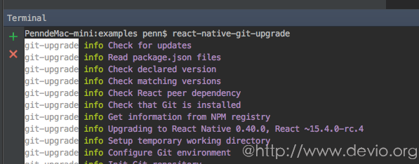

本文出自[《React Native学习笔记》](https://github.com/crazycodeboy/RNStudyNotes/)系列文章。


React Native作为一个有上千开发者参与的开源项目，自从2015年3月27日第一版发布以来到现在已经有147次版本发布了，平均起来几乎每周都会有新的版本发布。随着一次次版本的迭代，React Native也逐渐稳定，版本发布频率保持在了每一到两周一次。新版本不停的迭代对于React Native开发者来说，及时升级React Native版本让项目能够使用更多的API、新特性以及淘汰掉一些老的API，不仅成为了一门必修课也是一个不小的挑战。


升级一个React Native项目不仅需要JS部分还牵扯到Android项目和iOS项目，尽管React Native官方极力降低升级的繁琐，但如果两个React Native版本跨度较大的话升级起来还是需要不少工作量的。在这篇文章中我将向大家分享React Native升级的流程指南以及我在升级React Native过程中的一些经验心得。

## React Native升级流程
React Native升级流程可分为三大步：

1. 安装`react-native-git-upgrade` 模块；
2. 执行更新命令；
3. 解决冲突；


>心得：上述步骤都依赖于Git,没有安装Git客户端的小伙伴，需要安装一下。

### 1.安装`react-native-git-upgrade` 模块
首先我们需要安装`react-native-git-upgrade` 模块，打开终端执行下面命名即可：

```
$ npm install -g react-native-git-upgrade
```

安装成功后，会看到下图输出：


>心得：react-native-git-upgrade是一个命令行界面的工具，我们需要将它安装到全局，所以通过`npm install`命令安装的时候需要加上`-g`这个参数。

### 2.执行更新命令
安装过react-native-git-upgrade工具之后，我们就可以通过它来更新我们项目的React Native版本了，通过运行下面命令即可完成更新：

```
$ react-native-git-upgrade
```
通过这个命令可以将React Native更新到最新的版本，但不是预发布版哦。

>心得：我们需要在React Native项目的根目录下执行更新命令，也就是package.json所在的目录。

如果想更新到指定版本的React Native则需要在上述命令后加上指定版本的参数，如下：

```
$ react-native-git-upgrade X.Y.Z
```

这样以来，React Native便会被更新到X.Y.Z版，在运行这个命令时，需要将X.Y.Z替换成具体的版本。

更新命令执行成功之后，你会从终端看到如下输出：



从终端的输出中我们可以看出，更新的全过程以及我们所更新到的React Native版本。

另外，我们通过Version Control可以看出此次更新后发生变化的文件：


### 3.解决冲突

需要特别提到的是react-native-git-upgrade工具在更新React Native版本的时候会进行一个合并操作，也就是将我们本地的React Native版本和最新或指定的React Native版本进行合并，在合并过程中可能会产生一些冲突，在终端的输出中我们能清晰的看出发生冲突的文件：


从上图中我们可以看到AppDelegate.m与project.pbxproj发生了冲突，所以接下来我们需要处理发生冲突的文件。


>心得：一般来说，React Native版本跨度越大，产生冲突的可能性也就越大。

在处理冲突的时候通常我们会保留最新的代码移除老的代码，但具体还是要看了代码的具体功能后在做处理，比如，在上图中我们需要移除`#import "RCTBundleURLProvider.h"`与`#import "RCTRootView.h"`保留`#import <React/RCTBundleURLProvider.h>`、`#import <React/RCTRootView.h>`以及`#import "SplashScreen.h"`,为什么要保留`#import "SplashScreen.h" `呢，这是因为，`#import "SplashScreen.h"`是我们添加的，并不属于React Native的一部分。

>心得：另外一个需要特别提到的就是xxx.xcodeproj文件夹下所产生的冲突文件了，比如`project.pbxproj`，xxx.xcodeproj文件夹下存放的是整个iOS项目的一些配置文件，在处理这些文件冲突的时候我们需要特别注意文件的格式，处理不当很有可能导致真个iOS项目无法打开。

当处理完冲突后如果在打开iOS项目时出现`the project file cannot be parsed`错误：

则很可能是在处理xxx.xcodeproj文件夹下的冲突的时候破坏了文件的结构，导致XCode无法解析相应文件，要解决这个问题则需要找到出现问题的文件将被破坏的文件结构修复好。

到这里整个更新流程便走完了，现在我们便可以使用以及体验React Native最新版本的API以及特性了。

>心得：虽然我们完成了React Native的整个更新流程，但我们这个时候还需要运行一下我们的React Native项目，然后看一下各个功能是否正常，因为很有可能我们在项目中所使用的一些旧版的API在新版的React Native中已经被移除了，所以我们需要及时的更新被移除或被弃用的API。关于每一个版本所发生的具体变化我们可以查阅：[React Native项目的发布说明](https://github.com/facebook/react-native/releases)
。

## React Native v0.40+升级适配经验与心得

在2017年1月初，React Native发布了v0.40版本，并起名为December 2016，这也是2016年的最后一个版本。和以往一样每次React Native整版的发布都会带来一些大的变更，这次也不例外。在这篇文章中，我将向大家分享React Native v0.40对开发者影响比较大的变更以及升级到v0.40的一些经验心得。

关于如何升级React Native项目，可参考[React Native升级流程](#React Native升级流程)。

在昨天我对[react-native-splash-screen](https://github.com/crazycodeboy/react-native-splash-screen/)做了React Native v0.40适配，并按照[React Native升级流程](#React Native升级流程)的步骤，将[examples]()的React Native版本从v0.32升级到了 v0.40。在这里我会结合这次升级来讲解一下React Native v0.40所带来的一些变化。

>心得：升级的过程是痛苦的，但疼并快乐着。

### React Native v0.40所带来的一些重大变化

从React Native的[更新文档](https://github.com/facebook/react-native/releases)我们可以看到每次版本升级所带了的一些重大变化，在v0.40版本中也是一样。

#### iOS Native部分的头文件被移动

在 v0.40版本中，影响最为广泛的一个变化就是这个了，iOS Native部分的头文件被移动到了React下。这一变化直接导致所有原生模块和有引用React Native .h文件的代码在v0.40上无法运行。

在v0.40之前要导入一个React Native .h文件的格式是这样的：

```
#import "RCTUtils.h"
```
在v0.40版本导入一个React Native .h文件则变成了这个样子：

```
#import <React/RCTUtils.h>
```

为了解决我们需要将所有引用到了React Native .h文件的代码改成v0.40的写法。

可参考：[AppDelegate.m](https://github.com/crazycodeboy/react-native-splash-screen/commit/fec4d944747b1b2f3c3dde5fcdfad7702ec7c588#diff-7638dab4ccf49497742716e3b3a23d7d)

>心得：不仅于此，这一变更直接导致所有用到React Native .h的第三方库在没有做上述更改之前都无法兼容v0.40

#### require('image!...')引用图片方式不在支持

require('image!...')这种使用图片的方式已经被启用很久了，在v0.40版本中则直接把它移除了，也就是以后我们不能再通过这种方式来使用图片了。更多使用图片的方式可以参考官方文档：[Images使用](https://facebook.github.io/react-native/docs/images.html)

>心得：无论是在做React Native开发还是在做其他开发，一些被标记为deprecated的API，要及时的替换掉，因为在不久的将来这些被弃用的API很可能从SDK中移除。


