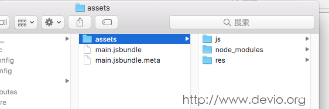
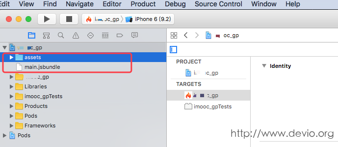

# React Native发布APP之打包iOS应用


### 第一步：导出js bundle包和图片资源
和打包React Native Android应用不同的是，我们无法通过命令一步进行导出React Native iOS应用。我们需要将JS部分的代码和图片资源等打包导出，然后通过XCode将其添加到iOS项目中

### 导出js bundle的命令
在React Native项目的根目录下执行：

```
react-native bundle --entry-file index.ios.js --platform ios --dev false --bundle-output release_ios/main.jsbundle --assets-dest release_ios/
```
通过上述命令，我们可以将JS部分的代码和图片资源等打包导出到release_ios目录下：



其中，assets为项目中的JS部分所用到的图片资源(不包括原生模块中的图片资源)，main.jsbundle是JS部分的代码。

>在执行打包命令之前，我们需要先确保在我们项目的根目录有`release_ios`文件夹，没有的话创建一个


### 第二步：将js bundle包和图片资源导入到iOS项目中
这一步我们需要用到XCode，选择assets文件夹与main.jsbundle文件将其拖拽到XCode的项目导航面板中即可



然后，修改AppDelegate.m文件，添加如下代码：

```objc
- (BOOL)application:(UIApplication *)application didFinishLaunchingWithOptions:(NSDictionary *)launchOptions
{
    
  NSURL *jsCodeLocation;
 //jsCodeLocation = [[RCTBundleURLProvider sharedSettings] jsBundleURLForBundleRoot:@"index.ios" fallbackResource:nil];
 +jsCodeLocation = [[NSBundle mainBundle] URLForResource:@"main" withExtension:@"jsbundle"];
#endif
...
  return YES;
}
```
上述代码的作用是让React Native去使用我们刚才导入的jsbundle，这样以来我们就摆脱了对本地nodejs服务器的依赖。

>提示：如果在项目中使用了[CodePush热更新]()，那么我们需要就可以直接通过CodePush来读取本地的jsbundle，方法如下：

```objc
- (BOOL)application:(UIApplication *)application didFinishLaunchingWithOptions:(NSDictionary *)launchOptions
{
  NSURL *jsCodeLocation;  
#ifdef DEBUG
    jsCodeLocation = [[RCTBundleURLProvider sharedSettings] jsBundleURLForBundleRoot:@"index.ios" fallbackResource:nil];
#else
    jsCodeLocation = [CodePush bundleURL];
#endif
...
  return YES;
}
```

到目前为止呢，我们已经将js bundle包和图片资源导入到iOS项目中，接下来我们就可以发布我们的iOS应用了


### 第三步：发布iOS应用

发布iOS应用我们需要有一个99美元的账号用于将App上传到AppStore，或者是299美元的企业级账号用于将App发布到自己公司的服务器或第三方公司的服务器

接下来我们就需要进行申请APPID ➜ 在Tunes Connect创建应用 ➜ 打包程序 ➜ 将应用提交到app store等几大步骤


