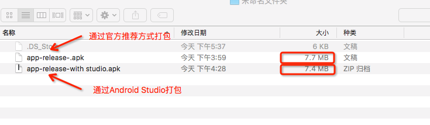
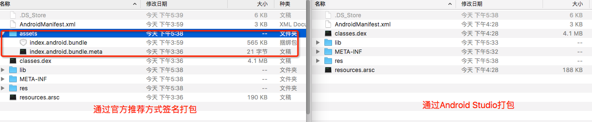

# React Native发布APP之签名打包APK  

#### APP的发布流程无外乎：签名打包—>发布到各store这两大步骤
Android要求所有的APP都需要进行数字签名后，才能够被安装到相应的设备上；<br/>
Android Studio中可以进行APP的签名打包，用Android Studio打包React Native APP不是一种推荐的方案；


## 为什么不用Android Studio打包React Native APP

APP在启动时存在闪退现象；<br/>
多试几次依然如此，这时让我想起每次通过terminal安装APP到模拟器上时，`launchPackager.command`终端都会输出`http://localhost:8081/index.android.bundle?platform=android&dev=true&hot=false&minify=false`这样一行信息，然后APP在启动页加载一会才进入应用。通过浏览器访问上面的链接，发现链接返回的是一个js文件，打开该文件发现文件中的代码其实是我们写的 React Native 的 JS 代码;
  
>**PS.**   
1. 在开发环境下，每次启动APP,都会连接JS Server将项目中编写的js文件代码加载到APP(这也是React Native的动态更新的精髓)；<br/>
2. 签名打包后的APK已经从开发环境变成了生产环境，自然不会在每次启动的时候连接JS Server加载相应的js文件。所以导致APP因缺少相应的js而无法启动； <br/>
3. 采用[React Native官方推荐的方式](http://facebook.github.io/react-native/docs/signed-apk-android.html)进行签名打包
	
	
	   
## Android Studio签名打包 vs 官方推荐方式签名打包差别 如图：
  
**大小上的差别：**   



对比两种打包方式发现，它们所生成的apk在大小上相差几百k。为什么会相差那么大呢，带着这个疑问我们就将两个apk解压之后看看他们内部具体有什么不同
  
**apk内部差别：**    



上图是解压之后apk的内部细节，发现通过官方推荐的方式打包的apk多了两个文件“index.android.bundle”与“index.android.bundle.meta”,打开“index.android.bundle”发现其和从`http://localhost:8081/index.android.bundle?platform=android&dev=true&hot=false&minify=false`获取的文件内容是一样的，都是我们写的 React Native 的 JS 代码  

>**结论** 
  
1. 在开发环境下，为方便调试，APP会在启动时从JS Server服务器将index.android.bundle文件加载到APP。  
2. 签名打包后的APP变成了生产环境，此时APP会默认从本地加载 index.android.bundle文件，由于通过Android Studio打包的APK没有将index.android.bundle打包进apk，所以会因缺少index.android.bundle而无法启动    


## 通过官方推荐的方式签名打包APK

### 第一步：生成Android签名证书  
如果你已经有签名证书可以绕过此步骤；<br/>
签名APK需要一个证书用于为APP签名，生成签名证书可以Android Studio以可视化的方式生成，也可以使用终端采用命令行的方式生成 (Mac系统下Android生成keystore.md)；


### 第二步：设置gradle变量   
1. 将你的签名证书copy到 android/app目录下;
2. 编辑`~/.gradle/gradle.properties`或`../android/gradle.properties`(一个是全局`gradle.properties`，一个是项目中的`gradle.properties`，大家可以根据需要进行修改) ，加入如下代码：     

```
MYAPP_RELEASE_STORE_FILE=your keystore filename  
MYAPP_RELEASE_KEY_ALIAS=your keystore alias  
MYAPP_RELEASE_STORE_PASSWORD=*****    
MYAPP_RELEASE_KEY_PASSWORD=*****  
```  
提示：用正确的证书密码、alias以及key密码替换掉 *****  注意全局gradle.properties是可以不用配置的


### 第三步：在gradle配置文件中添加签名配置   
编辑 android/app/build.gradle文件添加如下代码：  

```   
...  
android {  
    ...  
    defaultConfig { ... }  
    signingConfigs {  
        debug {
            storeFile file("/Users/wzh/test.keystore")
        }
        release {
            storeFile file("test.keystore")
            storePassword "wzhtest"
            keyAlias "test"
            keyPassword "123456"
            //storeFile file(MYAPP_RELEASE_STORE_FILE)
            //storePassword MYAPP_RELEASE_STORE_PASSWORD
            //keyAlias MYAPP_RELEASE_KEY_ALIAS
            //keyPassword MYAPP_RELEASE_KEY_PASSWORD
        }  
    }  
    buildTypes {  
        release {  
            ...  
            signingConfig signingConfigs.release  
        }  
    }  
}  
...  
```
**注意事项** 
>1. android/app/目录下；
2. ...表示build.gradle文件的默认配置；
3. 命令行下打包release的路径不对可以将信息直接写在release下

### 第四步：签名打包APK 

**注意事项** 
>如果build.gradle 里面 引入 apply from: "../../node_modules/react-native/react.gradle" 可以直接方法一
 
#### 打包文件的2种方式

#### 对存在react.gradle文件的项目打包，cd 进入主目录 

	$ cd android && ./gradlew assembleRelease
	
	
#### 对不存在react.gradle文件那么我们就需要生成assets文件夹，并且生成index.android.bundle文件

##### 方法一：利用curl生成
	$ cd test
	$ curl -k "http//localhost:8081/index.android.bundle" &amp;gt;android/app/src/main/assets/index.android.bundle

##### 方法二：首先命令切换到该react native项目的主目录，然后运行以下的命令，生成assets文件夹

	$ mkdir -p android/app/src/main/assets
	
##### 紧接着运行以下命令，进行生成index.android.bundle文件

	$ react-native bundle --platform android --dev false --entry-file index.android.js --bundle-output ./android/app/src/main/assets/index.android.bundle --assets-dest android/app/src/main/res/

	或者
	
	$ react-native bundle --entry-file index.android.js --bundle-output ./android/app/src/main/assets/index.android.jsbundle --platform android --assets-dest ./android/app/src/main/res/ --dev false

	$ cd android && ./gradlew assembleRelease

注意：打包中gradle版本出错,按提示信息更改版本即可 


签名打包成功后你会在 "android/app/build/outputs/apk/"目录下看到签名成功后的app-release.apk文件

#### 安装apk 
	
	$ cd android && ./gradle installRelease


提示：如果你需要对apk进行混淆打包 编辑android/app/build.gradle：   

```  
/**     
 * Run Proguard to shrink the Java bytecode in release builds.  
 */  
def enableProguardInReleaseBuilds = true  
```

## 如何在gradle中不使用明文密码？  
上文中直接将证书密码以明文的形式写在了gradle.properties文件中，虽然可以将此文件排除在版本控制之外，但也无法保证密码的安全，下面将向大家分享一种方法避免在gradle中直接使用明文密码。   

### 通过“钥匙串访问(Keychain Access)”工具保护密码安全  
下面阐述的方法只在OS X上可行。  
我们可以通过将发布证书密码委托在“钥匙串访问(Keychain Access)”工具中,然后通过gradle访问“钥匙串访问”工具来获取证书密码。  

### 具体步骤：  
1. `cmd+space`打开“钥匙串访问(Keychain Access)”工具。
2. 在登录选项中新钥匙串，如图：  
%E2%80%9D%E5%B7%A5%E5%85%B7%E4%BF%9D%E6%8A%A4%E5%AF%86%E7%A0%81%E5%AE%89%E5%85%A8%20%20.png)

提示： 你可以在terminal中运行如下命令检查新建的钥匙串是否成功。   
 `security find-generic-password -s android_keystore -w`  
3. 在build.gradle中访问你的秘钥串,将下列代码编辑到android/app/build.gradle中：   

```
def getPassword(String currentUser, String keyChain) {
   def stdout = new ByteArrayOutputStream()
   def stderr = new ByteArrayOutputStream()
   exec {
       commandLine 'security', '-q', 'find-generic-password', '-a', currentUser, '-s', keyChain, '-w'
       standardOutput = stdout
       errorOutput = stderr
       ignoreExitValue true
   }
   //noinspection GroovyAssignabilityCheck
      stdout.toString().trim()
}
```    

```
// Add this line
def pass = getPassword("YOUR_USER_NAME","android_keystore")
...
android {
    ...
    defaultConfig { ... }
    signingConfigs {
        release {
            storeFile file(MYAPP_RELEASE_STORE_FILE)
            storePassword pass // Change this
            keyAlias MYAPP_RELEASE_KEY_ALIAS
            keyPassword pass // Change this
        }
    }
    buildTypes {
        release {
            ...
            signingConfig signingConfigs.release
        }
    }
}
...
```   

**注意事项**   
钥匙串访问(Keychain Access)工具只是帮我们托管了，证书密码，证书明和alias还是需要我们在`gradle.properties`中设置一下的。
