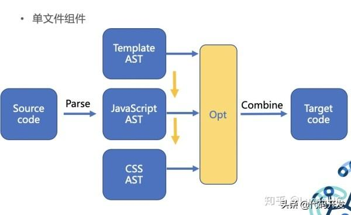
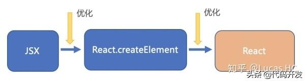

## VUE和REACT的区别

##### 相同点

1.都使用了Virtual DOM
2.都支持服务器端渲染
3.提供了响应式（Reactive）和组件化（Composable）的视图组件
4.都有’props’的概念，这是properties的简写。props在组件中是一个特殊的属性，允许父组件往子组件传送数据
5.构建工具：
React和Vue都有自己的构建工具，你可以使用它快速搭建开发环境。
React可以使用Create React App (CRA)，而Vue对应的则是vue-cli。两个工具都能让你得到一个根据最佳实践设置的项目模板。

##### 主要区别

1、理念上的差别

Vue推崇响应式思想。
是通过对数据的劫持/代理一系列操作来进行数据的变化。默认就是优化状态：你修改了多少数据，就触发多少更新。

React 推崇函数式思想。
数据的变化是通过直接进行局部重新渲染。但是 React 并不知道什么时候“应该去渲染”，所以触发局部重新变化是由开发者手动调用 setState 完成。
React setState 引起局部重新刷新。为了达到更好的性能，React 暴漏给开发者 shouldComponentUpdate 这个生命周期 hook，来避免不需要的重新渲染。
另外 React 为了弥补不必要的更新，会对 setState 的行为进行合并操作。因此 setState 有时候会是异步更新，但并不是总是“异步”。

React 对数据变化毫无感知，它就提供 React.createElement 调用生成 virtual dom。


2、以及核心差异对后续设计产生的不可逆影响

setup hook 是 vue3 推出的新功能，对标 react 的 setup hook。

React hook 底层是基于链表(Array)实现，每次组件被 render 的时候都会**顺序执行所有的 hooks**，因为底层是链表，每一个 hook 的 next 是指向下一个 hook 的，所以要求开发者不能在不同 hooks 调用中使用判断条件，因为 if 会导致顺序不正确，从而导致报错。

Vue3 hook 只会被**注册调用一次**，Vue之所以能避开这些麻烦的问题，根本原因在于它对数据的响应是基于响应式的，是对数据进行了代理的。不需要链表进行 hooks 记录，它对数据直接代理观察。

但是 Vue 这种响应式的方案，也有自己的困扰。比如 useState()返回的是一个 value wrapper (包装对象)。一个包装对象只有一个属性：.value ，该属性指向内部被包装的值。我们知道在 JavaScript 中，原始值类型如 string 和 number 是只有值，没有引用的。不管是使用 Object.defineProperty 还是 Proxy，我们无法追踪原始变量后续的变化。因此 Vue 不得不返回一个包装对象，不然对于基本类型，它无法做到数据的代理和拦截。


3、Vue 和 React 在 API 设计风格的不同

React 事件系统庞大而复杂。它暴漏给开发者的事件不是原生事件，并且 this 不是指向组件或者实例本身。
React 对所有事件都进行了代理，将所有事件都绑定 document 上。

```
React暴漏给开发者的事件不是原生事件，是 React 包装过合成事件，并且非常重要的一点是，合成事件是池化的。
也就是说不同的事件，可能会共享一个合成事件对象。
```


相对来说，Vue事件就没有那么庞大复杂，并且Vue 事件处理函数中的 this 默认指向组件实例。


4、渲染方式

jsx 和手写的 render function 是完全动态的，过度的灵活性导致运行时可以用于优化的信息不足，所以 react 就只能显示调用 setState 来强行更新组件。
由于无从减掉一些不必要的渲染对比，所以 react 对此的解决方法就是引入了时间分片 react fibber，把 patch 并且更新视图的过程切分成多个任务，分批更新。

vue 会标明某些 dom 是静态的，并且 Vue 3.0 提出的动静结合的 DOM diff 思想，开始做到了标记哪个 DOM 绑定了变量需要 patch，省去也不必要的 patch 更新的优化操作。
因为 Vue core 可以静态分析 template，在解析模版时，整个 parse 的过程是利用正则表达式顺序解析模板，当解析到开始标签、闭合标签、文本的时候都会分别执行对应的回调函数，来达到构造 AST 树的目的。




React无法从模版层面进行静态分析，开发者在项目中开发 babel 插件，实现 JSX 编译成 React.createElement，那么优化手段就是在 babel 插件上处理。




5、Vuex 和 Redux

从实现原理上来说，最大的区别是两点：

Redux 使用的是不可变数据，Redux每次都是用新的state替换旧的state。

Vuex的数据是可变的，Vuex是直接修改。

Redux 在检测数据变化的时候，是通过 diff 的方式比较差异的。

Vuex其实和Vue的原理一样，是通过 getter/setter来比较的（如果看Vuex源码会知道，其实他内部直接创建一个Vue实例用来跟踪数据变化）。


## 参考

[Vue 和 React 的核心差异](https://www.cnblogs.com/everlose/p/12538474.html)

