## 基础使用

**class使用方式:**

- 对象语法
	- v-bind:class="{ '类名-a': 布尔值, '类名-b': 布尔值 }"
- 数组语法
	- v-bind:class="[classA, classB]"
		- data: {classA: '类名-a',classB: '类名-b'}
	- v-bind:class="[classA, isB ? classB : '']"  （三元表达式）

**style使用方式:**

 - 对象语法
	 -  `

`
		 -  `data: {activeColor: 'red',fontSize: 30}`
	 -  推荐  `

 `
- 数组语法
	- `
`

**循环的用法:**

>在循环中添加 <li v-for="val in arr" `:key="$index"`>  提升循环性能

- 对象
	- `<li v-for="(v,k) in obj"></li> `

- 数组
	- `<li v-for="val in arr"></li> `

**条件渲染**

- v-else 元素必须紧跟在 v-if 或 v-show 元素的后面——否则它不能被识别。
- 一般来说， v-if 有更高的切换消耗而 v-show 有更高的初始渲染消耗。
	- 因此，如果需要 **频繁切换使用 v-show **较好，如果在 运行时条件不**大可能改变使用 v-if 较好**。

**绑定事件的2种方式:**

1.  v-on:click="fn( )";
2.  @click="fn( )"  ` 推荐`

**属性绑定的2种方式:**

- v-bind:src=""   （src可写成   width/height/title 等等 ）
- :src=""    推荐

**模板的几种使用方法:**

- {{msg}}         数据更新模板变化
- {{*msg}}       数据只绑定一次
- {{{msg}}}      HTML转意输出

**事件对象: （事件发生时触发的对象，对象里有各种信息）**

- @click="fn($event)"   
	- 传入形参，必须是 $event

**阻止冒泡的俩种方式: **
- ev.cancelBubble=true;    原声写法
- @click.stop                    `推荐`

**阻止默认行为的俩种方式(默认事件):**

- ev.preventDefault();
- @contextmenu.prevent    `推荐`

**监听数据变化**

- 浅度监听
	- Vm.$watch(name,fnCb);                    
- 深度监听（也就是可以监视 复杂嵌套数据的变化）
	- vm.$watch(name, fnCb,{deep:true}); 

**防止花括号闪烁**

1. 此方法一般会用在比较大的段落，也就是段落中 {{ }} 比较多的地方
	- 在使用花括号的父元素设置 v-cloak 属性
	- 在样式设置  [v-cloak]{ display: none; }
2. ``   `推荐`

**一些实例的简单方法**

- vm.$el      就是那个元素
- vm.$data  就是那个data对象
- vm.$destroy  破坏（销毁）对象 
- vm.$log()    查看现在data对象里面数据的状态
- vm.$mount 手动安装 （挂载）
	-  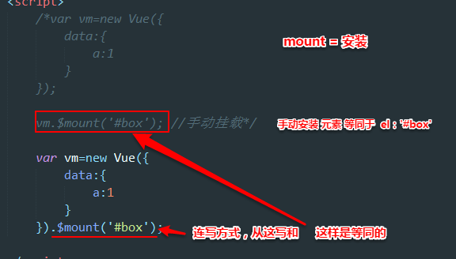

- vm.$options 自定义属性
	-  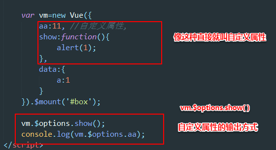

## 关于各项自定义

- 自定义键盘信息
	- Vue.config.keyCodes.`kkk`=17  ( 自定义 )
	-` <li @keyup.kkk='add()'></li>`  （调用）
- 自定义过滤器
	- 举例：自定义时间过滤器
	-  

- 自定义指令
	-  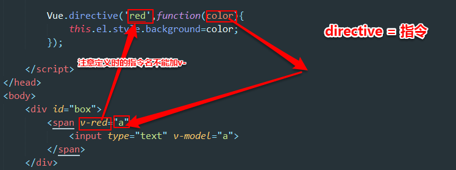

- 自定义插件
	- 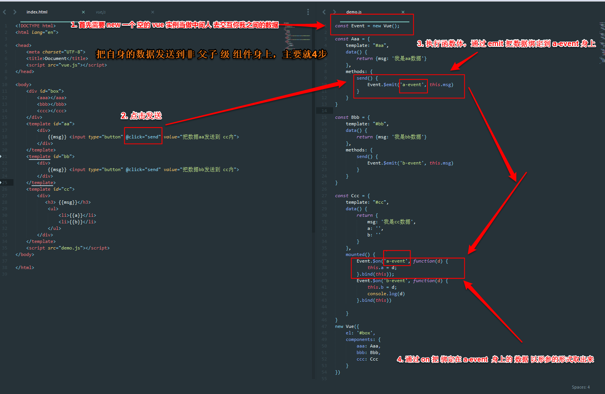

- 自定义元素指令（elementDirective） 用处不大，因为有更靠谱的 vue 组件，此处略过

## Vue交互

**如果vue想做交互：需要引入vue-resouce文件**

- Get 交互
	- 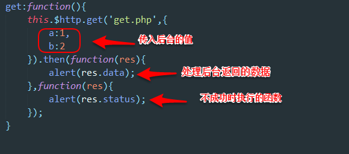

- Post 交互
	- 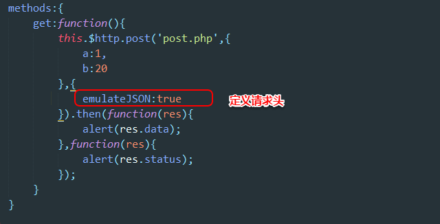

- Jsonp
	- 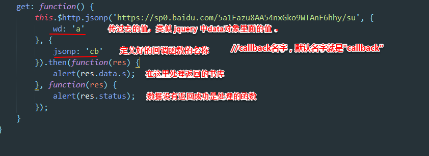

如何抓取 Jsonp 数据？

- 抓取 百度 数据
	- 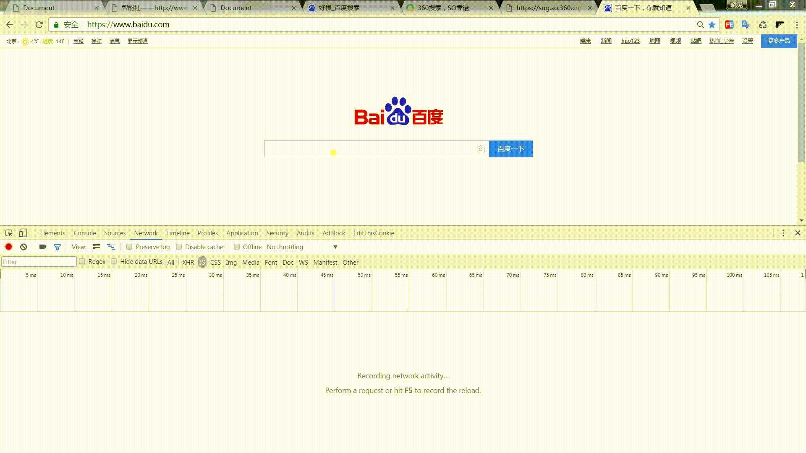

- 抓取 360 数据
	- 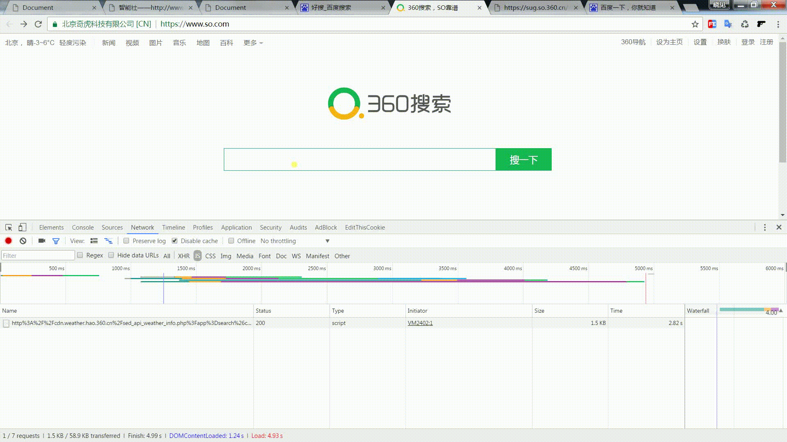

## 关于组件

 - **全局与局部组件** 
	 - 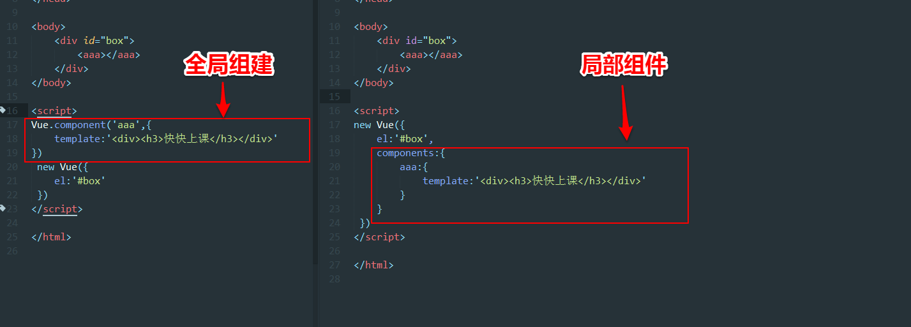

- **动态组件**
	- 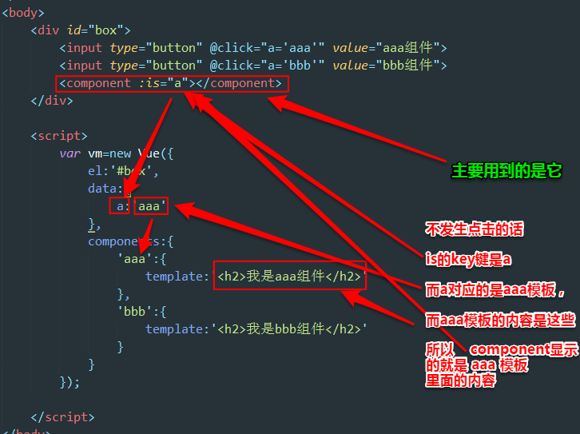

- **组件模板的另一种使用方法（常用）**
	- 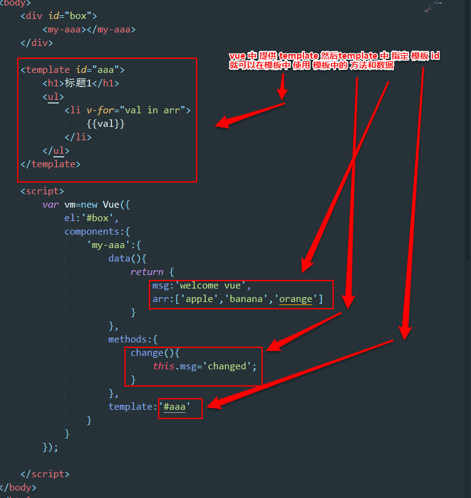

## 父子组件与非父子组件的数据交互

- **什么是父子组件**

	- vue 中默认 子组件无法直接访问父组件数据
	- 子组件只能写在父组件的 template 中
	-  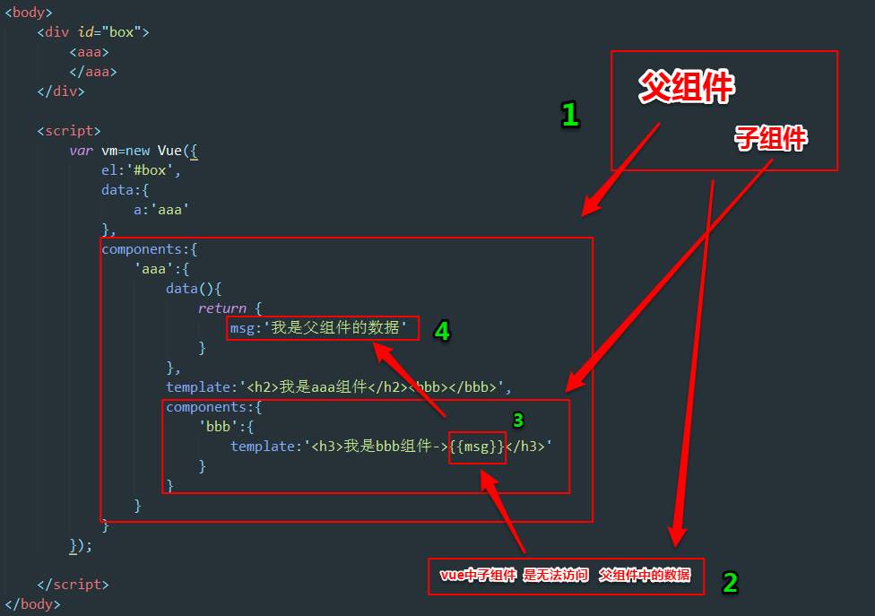

----------------------------

- **那么子组件如何才能访问到父组件的数据呢**

	 - 可以通过属性 props 在子组件中定义绑定的指定，然后在子组建中用作为指令值之后，子组件便可访问父组件数据
	 * props 的值 可以是 数组 可以是 JSON 
			* props:['m','myMsg']
			* props:{'m':String,'myMsg':Number}
	

----------------------------

- **那么父组件又如何访问子组件的数据呢**
	
	 - 原理就是：子组件主动把自己的数据发送到父级就可以了
		 - 子级如何发送?
		 - 父级如何接受?
	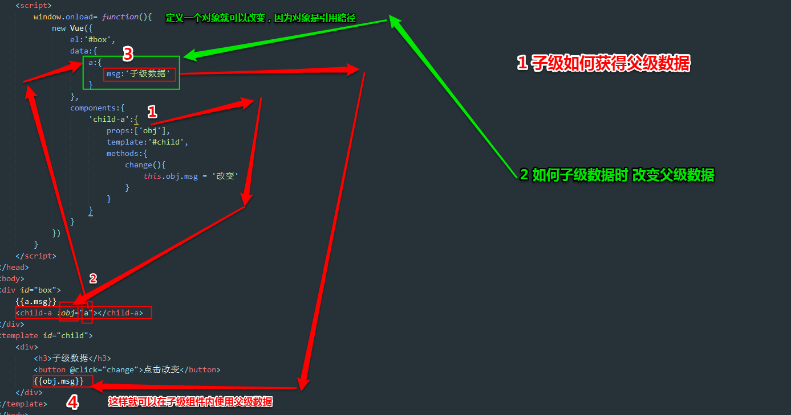

----------------------------

- **那么问题又来了，非父子组件数据如何交互呢？**

	 - 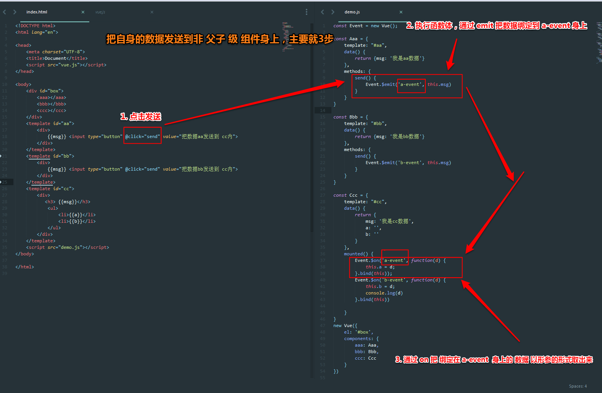

## 生命周期

这些生命周期的函数 就叫 **钩子函数**

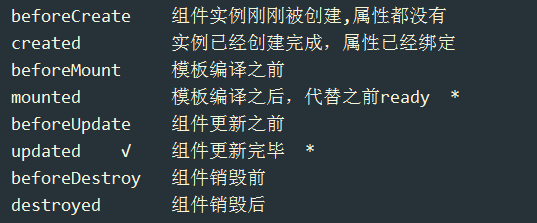

## slot ( 沟槽 )

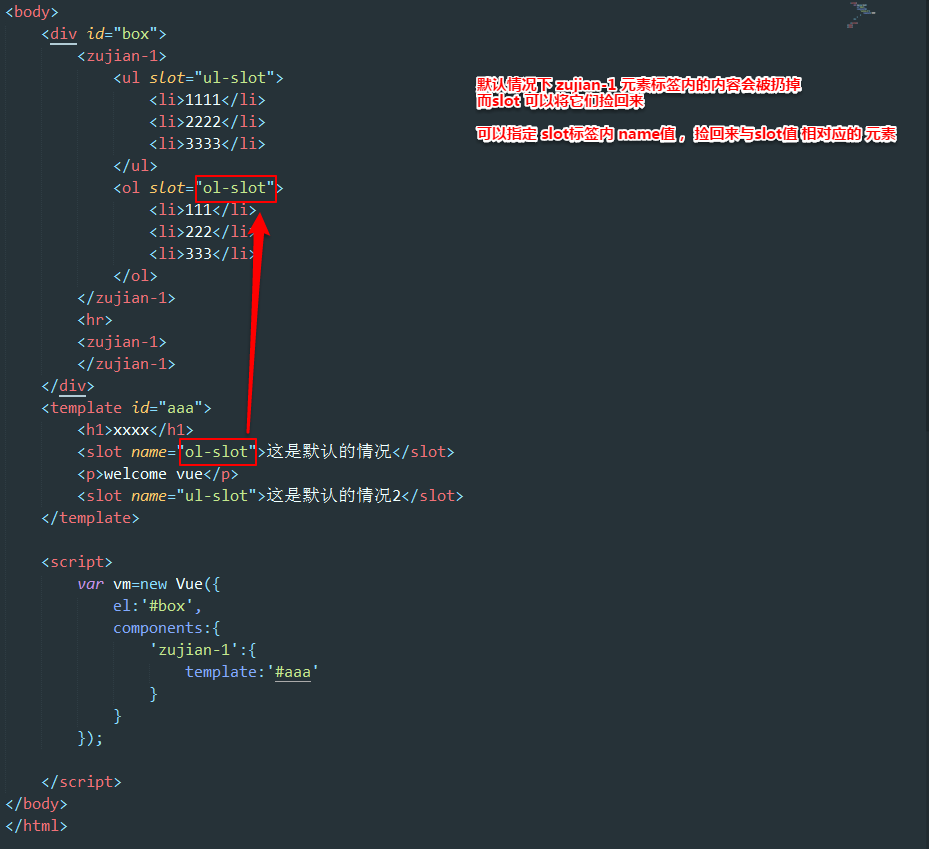

## router （路由）

- **路由是干啥的？**

1. 能做 SPA 应用（也就是单页面应用）
2. 能根据不同url地址，显示不同效果

- **关于路由的 hello world**

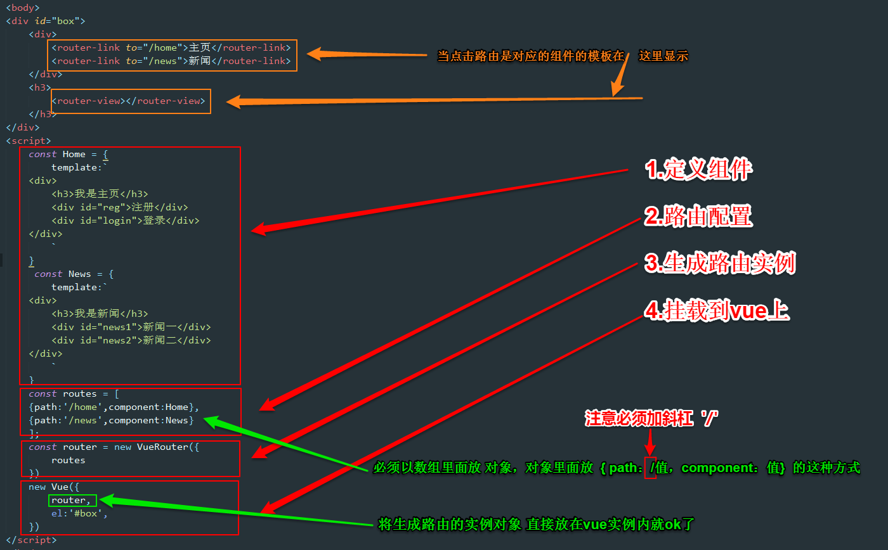

----------------------------

- **路由嵌套  （多层路由）**
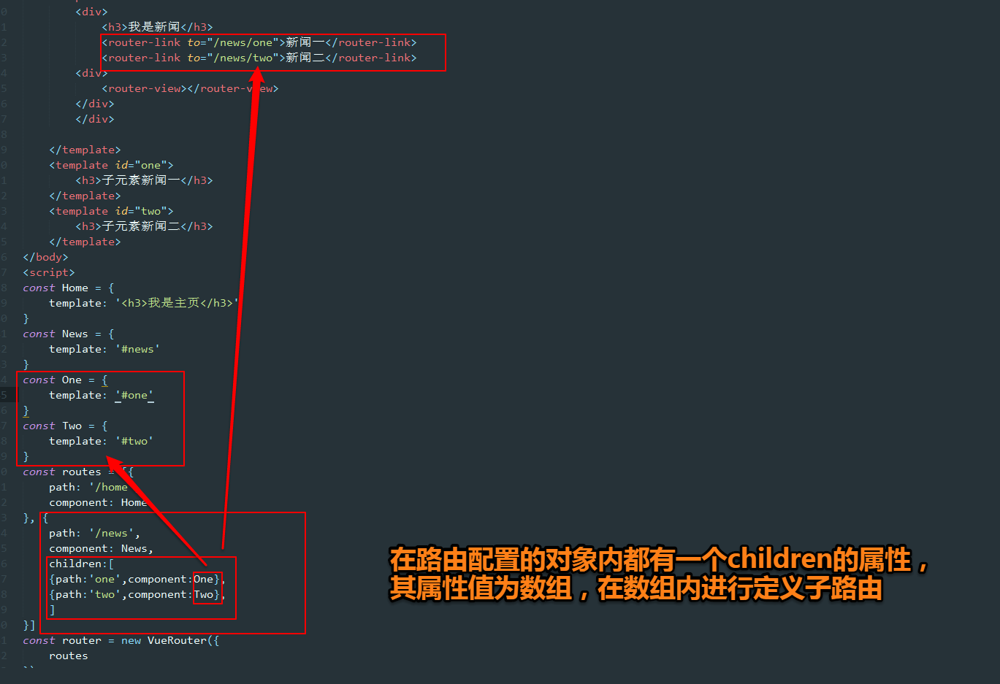

----------------------------

- **路由的其他信息的获取**
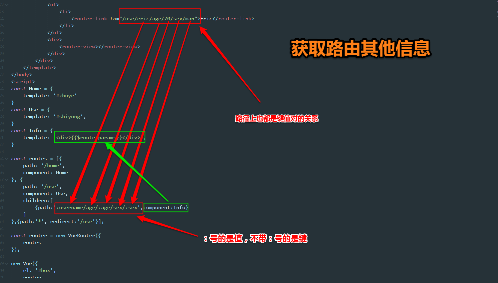

----------------------------

## 脚手架模板代码执行逻辑

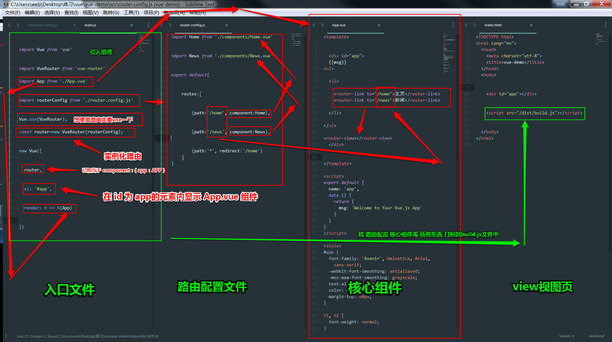

